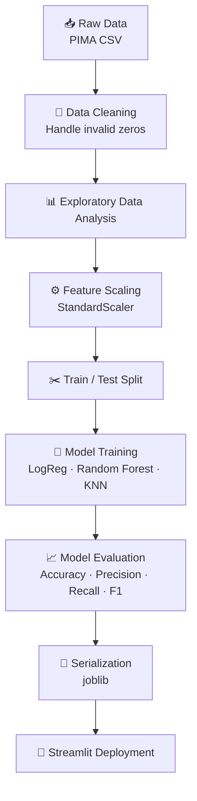

<div align="center">

# 🩺 Diabetes Prediction System

**An end-to-end Machine Learning application for predicting diabetes risk using clinical measurements — featuring data preprocessing, model comparison, evaluation, and interactive deployment through Streamlit.**

[🚀 Live Demo](https://diabetes-prediction-system-zhnsdbyfenhgd5xgjq4ngt.streamlit.app/) • [📂 Repository](https://github.com/rizwanahmed786508/diabetes-prediction-system) • [📓 Notebook](Diabetes_Prediction.ipynb) • [🐛 Report Issue](https://github.com/rizwanahmed786508/diabetes-prediction-system/issues)

</div>

---

## 📑 Table of Contents

- [Project Overview](#-1-project-overview)
- [Problem Statement](#-2-problem-statement)
- [Business Objective](#-3-business--clinical-objective)
- [Dataset](#-4-dataset)
- [Exploratory Data Analysis](#-5-exploratory-data-analysis-eda)
- [Data Preprocessing](#-6-data-preprocessing)
- [ML Pipeline](#-7-machine-learning-pipeline)
- [Models Used](#-8-models-used)
- [Model Performance](#-9-model-performance)
- [Results Dashboard](#-10-results-dashboard)
- [Technologies Used](#%EF%B8%8F-11-technologies-used)
- [Application Interface](#%EF%B8%8F-12-application-interface)
- [Project Structure](#-13-project-structure)
- [Live Demo](#-14-live-demo)
- [Installation](#%EF%B8%8F-15-installation)
- [Usage](#%EF%B8%8F-16-usage)
- [Future Improvements](#-17-future-improvements)
- [Key Learnings](#-18-key-learnings)
- [Conclusion](#-19-conclusion)
- [Author](#-author)

---

## 📌 1. Project Overview

Diabetes affects over 500 million people worldwide, and early detection is one of the most effective ways to prevent long-term complications like cardiovascular disease, kidney failure, and vision loss. In many clinics, risk screening still relies on manual review of lab results — a process that is slow and inconsistent across practitioners.

This project builds a supervised machine learning pipeline that predicts whether a patient is likely diabetic using eight routine clinical measurements, then packages the model behind a simple web interface so a non-technical user (e.g., a nurse or patient) can get an instant risk estimate.

**The objective is not only to train an accurate model, but to demonstrate a complete Machine Learning workflow from raw data to deployment** — data cleaning, EDA, model comparison, evaluation, and a live, usable interface, rather than a notebook that stops at `model.fit()`.

---

## ❓ 2. Problem Statement

* Diabetes is frequently under-diagnosed until symptoms become severe.
* Manual risk assessment depends on clinician experience and does not scale for large-population screening.
* Key clinical indicators (glucose, BMI, blood pressure, family history) interact in ways that are hard to judge by eye, but are well-suited to statistical learning.
* A lightweight, interpretable ML model can flag high-risk patients early and support — not replace — clinical judgment.

---

## 🎯 3. Business / Clinical Objective

* **Predict:** binary diabetes outcome (0 = non-diabetic, 1 = diabetic) from patient measurements.
* **Who benefits:** clinics and telehealth platforms doing first-pass risk screening; individuals checking their own risk before a formal diagnostic workup.
* **Impact:** faster triage, more consistent risk flags than manual heuristics, and a low-cost pre-screening step before expensive diagnostic testing.

> ⚠️ **Disclaimer:** this tool is for educational/screening purposes only and is not a substitute for professional medical diagnosis.

---

## 📊 4. Dataset

**Source:** [PIMA Indians Diabetes Dataset](https://www.kaggle.com/datasets/uciml/pima-indians-diabetes-database) (UCI Machine Learning Repository, via Kaggle)

### Dataset Statistics

| Metric | Value |
|---|---|
| Samples | 768 patient records |
| Features | 8 clinical measurements |
| Target | `Outcome` (binary: 0 / 1) |
| Missing Values | None reported as NaN — *but see data quality note below* |
| Class Distribution | ⚠️ *Add exact split — this dataset is commonly ~65% non-diabetic / 35% diabetic; confirm and insert your actual counts here* |

### Feature Table

| Feature | Description |
|---|---|
| Pregnancies | Number of pregnancies |
| Glucose | Plasma glucose concentration |
| BloodPressure | Diastolic blood pressure (mm Hg) |
| SkinThickness | Triceps skin fold thickness (mm) |
| Insulin | 2-Hour serum insulin (mu U/ml) |
| BMI | Body Mass Index |
| DiabetesPedigreeFunction | Diabetes hereditary/genetic score |
| Age | Age of patient (years) |
| **Outcome** | **Target** — Diabetes status (0 = No, 1 = Yes) |

**📝 Data quality note to add:** this dataset has a known quirk — `0` values in `Glucose`, `BloodPressure`, `SkinThickness`, `Insulin`, and `BMI` are not biologically valid and actually represent missing data. State explicitly how you handled this (e.g., median imputation grouped by Outcome). Calling this out signals real data-quality awareness to reviewers.

---

## 📈 5. Exploratory Data Analysis (EDA)

### Correlation Heatmap


**Key Insights**
* Glucose shows the strongest relationship with diabetes outcome among all features.
* BMI and Age show a moderate positive correlation with diabetes risk.
* Pregnancies and Age are correlated with each other, as expected biologically.

*(Replace the bullets above with your actual correlation values once confirmed from the notebook — approximate figures are fine, e.g., "Glucose correlates with Outcome at ~0.47.")*

### Feature Distribution


**Key Insights**
* Older patients tend to show higher diabetes prevalence.
* Several features (Insulin, SkinThickness) are right-skewed, suggesting outliers or missing-value artifacts.
* The dataset is moderately imbalanced between diabetic and non-diabetic classes.

**📝 Recommended additional charts:**
- Class balance bar chart (diabetic vs. non-diabetic counts)
- Box plots of Glucose/BMI split by Outcome, to visually show class separability

---

## 🧹 6. Data Preprocessing

* **Missing value handling:** biologically invalid zeros in Glucose, BloodPressure, SkinThickness, Insulin, and BMI treated as missing and imputed *(state your exact method — median/mean by class — here)*.
* **Feature scaling:** `StandardScaler` applied to normalize feature ranges, important for distance-based models like KNN.
* **Train/Test split:** dataset split into training and testing sets *(add your exact ratio, e.g., 80/20, and whether it was stratified)*.
* **Encoding:** not required — all features are numeric.

---

## 🔄 7. Machine Learning Pipeline



*(This renders automatically on GitHub. If it doesn't render in your repo, GitHub may need the code fence to say exactly ` ```mermaid ` with no extra characters — copy it as-is.)*

---

## 🤖 8. Models Used

| Model | Accuracy | Precision | Recall | F1 Score |
|---|---|---|---|---|
| Logistic Regression | 75.32% | *add* | *add* | *add* |
| Random Forest Classifier | **75.97%** | *add* | *add* | *add* |
| K-Nearest Neighbors (KNN) | 69.48% | *add* | *add* | *add* |

**Why Random Forest was selected (not just "highest accuracy"):**
* **Better robustness** — as an ensemble of decision trees, it averages out the variance of any single tree, making it less sensitive to noisy or outlier-heavy features like Insulin and SkinThickness.
* **Non-linear relationships** — it naturally captures interactions between features (e.g., Glucose × BMI) without manual feature engineering.
* **Less overfitting, better generalization** — bagging across many trees reduces the risk of memorizing the training set, which single models like KNN are more prone to on small datasets.
* **Interpretability** — it exposes feature importances, which matters in healthcare where "why" is as important as "what."

**⚠️ Important:** in a medical screening context, **Recall (sensitivity)** matters more than raw Accuracy — missing an actual diabetic patient (false negative) is more costly than a false alarm (false positive). Add Precision/Recall/F1 numbers from your notebook to the table above to make this comparison meaningful rather than accuracy-only.

---

## 📊 9. Model Performance

### Confusion Matrix


**In plain English:** the confusion matrix shows how many patients were correctly vs. incorrectly classified in each outcome class. *(Add 1–2 sentences here once you have exact numbers, e.g., "The model correctly identified X% of diabetic patients while keeping false positives low.")*

**📝 Recommended additions:**
- **Classification Report** — Precision/Recall/F1 per class, so the accuracy numbers above have full context.
- **ROC Curve** — you already advertise ROC-AUC 76% via badge; showing the actual curve backs that number up visually.
- **Feature Importance Plot** — from the Random Forest model. Often the single most compelling chart in a healthcare ML project, since it shows which clinical factors drive risk.
- **Prediction Examples** — 2–3 sample inputs with the model's predicted probability, to make the output concrete for a non-technical reviewer.

---

## 🏆 10. Results Dashboard

| 📦 Samples | 🧬 Features | 🤖 Models Compared | 🎯 Best Accuracy | 🚀 Deployment | 🔮 Prediction Type |
|:---:|:---:|:---:|:---:|:---:|:---:|
| 768 | 8 | 3 (LogReg, RF, KNN) | **75.97%** (Random Forest) | Streamlit Cloud | Binary Classification |

---

## 🛠️ 11. Technologies Used


> Your original README also listed **Tkinter** alongside Streamlit — if the deployed app is Streamlit-only now, consider removing Tkinter from the stack list so reviewers aren't confused about which UI is actually live.

---

## 🖥️ 12. Application Interface

<details>
<summary><b>Click to view screenshots</b></summary>

**Home Interface**


**Prediction Interface**


</details>

**📝 Screenshots to add if not already captured:**
* Prediction Result view (showing the model's output/probability for a sample patient)
* A short GIF of the full user flow (input → predict → result) — GIFs consistently outperform static screenshots for recruiter attention

---

## 📂 13. Project Structure

```text
diabetes-prediction-system/
│
├── data/
│   └── diabetes.csv
│
├── images/
│   ├── gui.png
│   ├── gui2.png
│   ├── heatmap.png
│   ├── distribution.png
│   └── confusion_matrix.png
│
├── models/
│   ├── Diabetes_Model.pkl
│   └── diabetes_scaler.pkl
│
├── Diabetes_Prediction.ipynb
├── app.py
├── requirements.txt
├── .gitignore
└── README.md
```

**📝 To add:** a `.gitignore` file if not already present (to exclude `__pycache__/`, `.ipynb_checkpoints/`, virtual environment folders, etc.) — a small detail, but its absence is often noticed by reviewers checking repo hygiene.

---

## 🚀 14. Live Demo

<div align="center">

### 🔗 [**Open the Diabetes Prediction App →**](https://diabetes-prediction-system-zhnsdbyfenhgd5xgjq4ngt.streamlit.app/)

Enter patient measurements (Glucose, BMI, Age, etc.) and get an instant diabetes risk prediction in your browser — no installation required.

</div>

---

## 📦 Repository

🔗 **[github.com/rizwanahmed786508/diabetes-prediction-system](https://github.com/rizwanahmed786508/diabetes-prediction-system)**

---

## ⚙️ 15. Installation

```bash
# Clone the repository
git clone https://github.com/rizwanahmed786508/diabetes-prediction-system.git
cd diabetes-prediction-system

# Install dependencies
pip install -r requirements.txt
```

---

## ▶️ 16. Usage

```bash
streamlit run app.py
```

Then open the local URL Streamlit prints in your terminal, enter the requested patient details in the form, and click **Predict** to view the diabetes risk result.

---

## 🔮 17. Future Improvements

1. **Explainable AI (SHAP)** — per-prediction explanations of which features drove the risk score
2. **Hyperparameter Tuning** — GridSearchCV / Optuna for the Random Forest model
3. **XGBoost / LightGBM** — add to the model comparison table
4. **Docker** — containerize the app for reproducible deployment
5. **CI/CD** — GitHub Actions for automated testing on every push
6. **Cloud Deployment** — AWS/GCP/Azure alongside Streamlit Cloud
7. **MLOps** — experiment tracking (MLflow/Weights & Biases)
8. **Monitoring & Retraining** — scheduled retraining as new data becomes available

---

## 🧠 18. Key Learnings

*(Write 3–5 sentences in your own words — this section matters a lot to internship/scholarship reviewers because it shows self-reflection, not just execution. Some prompts to answer:)*
* What was the hardest part of this project — the data cleaning, the model comparison, or the deployment?
* What ML concept "clicked" for you while building this (e.g., why scaling matters for KNN but not for Random Forest)?
* What would you do differently if you started over?
* What did deploying a model to Streamlit teach you that training it in a notebook didn't?

---

## ✅ 19. Conclusion

This project demonstrates a complete, deployable machine learning workflow for diabetes risk prediction — from raw clinical data to a live, interactive web application. It reflects practical, healthcare-relevant ML engineering: handling real-world data quality issues, comparing multiple algorithms with an eye toward generalization rather than a single accuracy number, and shipping a model that a non-technical user can actually interact with. With the additions recommended above — class balance handling, feature importance, SHAP explainability — this moves from a strong portfolio piece toward a genuinely production-aware case study.

---

## 👨‍💻 Author

**Rizwan Ahmed**

[](https://github.com/rizwanahmed786508)

📝 **To add (do not leave blank on your live repo):** LinkedIn profile badge and contact email. I haven't invented these since they weren't in your original README — but recruiters actively look for a LinkedIn link on ML portfolio repos, so add yours here in the same badge style as GitHub above.
