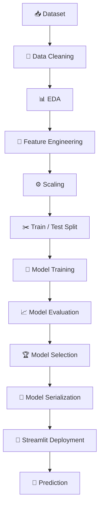
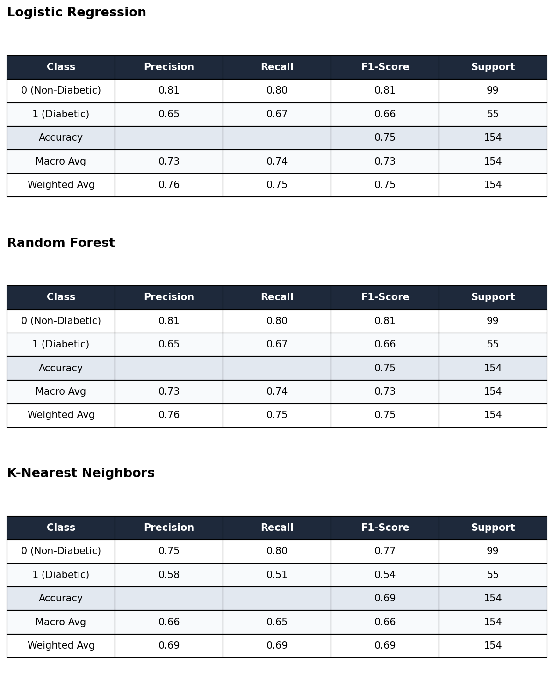
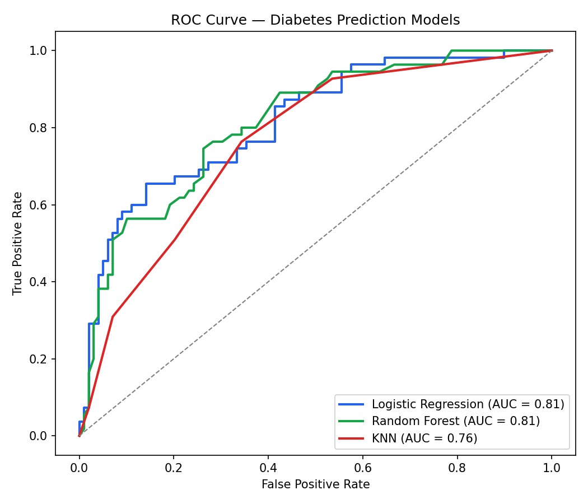
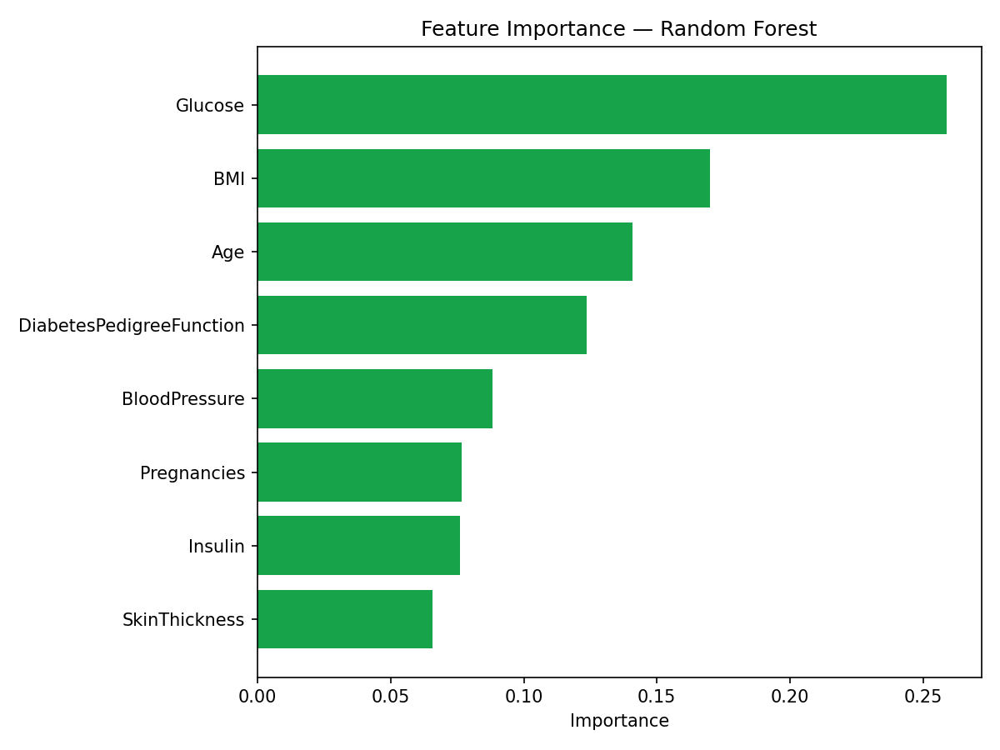

<div align="center">


### An end-to-end Machine Learning application for predicting diabetes risk using clinical measurements — featuring data preprocessing, model comparison, evaluation, and interactive deployment through Streamlit.

<p>
<a href="https://diabetes-prediction-system-zhnsdbyfenhgd5xgjq4ngt.streamlit.app/"></a>
<a href="https://github.com/rizwanahmed786508/diabetes-prediction-system"></a>
<a href="Diabetes_Prediction.ipynb"></a>
</p>

</div>

---

## 📑 Table of Contents

- [Project Overview](#-1-project-overview)
- [Problem Statement](#-2-problem-statement)
- [Business Objective](#-3-business--clinical-objective)
- [Dataset](#-4-dataset)
- [Exploratory Data Analysis](#-5-exploratory-data-analysis-eda)
- [Data Preprocessing](#-6-data-preprocessing)
- [ML Pipeline](#-7-machine-learning-pipeline)
- [Models Used](#-8-models-used)
- [Model Performance](#-9-model-performance)
- [Results Dashboard](#-10-results-dashboard)
- [Technologies Used](#%EF%B8%8F-11-technologies-used)
- [Application Interface](#%EF%B8%8F-12-application-interface)
- [Project Structure](#-13-project-structure)
- [Live Demo](#-14-live-demo)
- [Installation](#%EF%B8%8F-15-installation)
- [Usage](#%EF%B8%8F-16-usage)
- [Future Improvements](#-17-future-improvements)
- [Key Learnings](#-18-key-learnings)
- [Conclusion](#-19-conclusion)
- [Author](#-author)

---

## 📌 1. Project Overview

Diabetes affects over 500 million people worldwide, and early detection is one of the most effective ways to prevent long-term complications like cardiovascular disease, kidney failure, and vision loss. In many clinics, risk screening still relies on manual review of lab results — a process that is slow and inconsistent across practitioners.

This project builds a supervised machine learning pipeline that predicts whether a patient is likely diabetic using eight routine clinical measurements, then packages the model behind a simple web interface so a non-technical user (e.g., a nurse or patient) can get an instant risk estimate.

> **The objective is not only to train an accurate model, but to demonstrate a complete Machine Learning workflow from raw data to deployment** — data cleaning, EDA, model comparison, evaluation, and a live, usable interface, rather than a notebook that stops at `model.fit()`.

---

## ❓ 2. Problem Statement

* Diabetes is frequently under-diagnosed until symptoms become severe.
* Manual risk assessment depends on clinician experience and does not scale for large-population screening.
* Key clinical indicators (glucose, BMI, blood pressure, family history) interact in ways that are hard to judge by eye, but are well-suited to statistical learning.
* A lightweight, interpretable ML model can flag high-risk patients early and support — not replace — clinical judgment.

---

## 🎯 3. Business / Clinical Objective

* **Predict:** binary diabetes outcome (0 = non-diabetic, 1 = diabetic) from patient measurements.
* **Who benefits:** clinics and telehealth platforms doing first-pass risk screening; individuals checking their own risk before a formal diagnostic workup.
* **Impact:** faster triage, more consistent risk flags than manual heuristics, and a low-cost pre-screening step before expensive diagnostic testing.

> ⚠️ **Disclaimer:** this tool is for educational/screening purposes only and is not a substitute for professional medical diagnosis.

---

## 📊 4. Dataset

**Source:** [PIMA Indians Diabetes Dataset](https://www.kaggle.com/datasets/uciml/pima-indians-diabetes-database) (UCI Machine Learning Repository, via Kaggle)

### Dataset Statistics

| Metric | Value |
|---|---|
| Samples | 768 patient records |
| Features | 8 clinical measurements |
| Target | `Outcome` (binary: 0 / 1) |
| Missing Values | 0 as `NaN` — *but see data quality note below* |
| Class Distribution | **500 Non-Diabetic (65.1%)** · **268 Diabetic (34.9%)** — moderately imbalanced |

### Feature Table

| Feature | Description |
|---|---|
| Pregnancies | Number of pregnancies |
| Glucose | Plasma glucose concentration |
| BloodPressure | Diastolic blood pressure (mm Hg) |
| SkinThickness | Triceps skin fold thickness (mm) |
| Insulin | 2-Hour serum insulin (mu U/ml) |
| BMI | Body Mass Index |
| DiabetesPedigreeFunction | Diabetes hereditary/genetic score |
| Age | Age of patient (years) |
| **Outcome** | **Target** — Diabetes status (0 = No, 1 = Yes) |

> ⚠️ **Data quality note (verified from the notebook):** this dataset has a known quirk — `0` values in `Glucose`, `BloodPressure`, `SkinThickness`, `Insulin`, and `BMI` are not biologically valid and actually represent missing data. Checking the actual data confirms real zero-counts of **Glucose: 5, BloodPressure: 35, SkinThickness: 227, Insulin: 374, BMI: 11** out of 768 rows. **The current notebook does not impute or handle these zeros** — `df.isnull().sum()` returns 0 for every column because the missing values are encoded as `0`, not `NaN`, so they pass the null-check silently and flow straight into training. This is the single most valuable and easy fix to add next: replacing these zeros with the median (ideally grouped by `Outcome`) would likely improve model performance and is exactly the kind of data-quality step reviewers look for.

---

## 📈 5. Exploratory Data Analysis (EDA)

### Correlation Heatmap


**Key Insights**
* Glucose shows the strongest relationship with diabetes outcome among all features — this is confirmed later by the Random Forest feature importance ranking below.
* BMI, Age, and DiabetesPedigreeFunction show a moderate positive relationship with diabetes risk.
* Pregnancies and Age are correlated with each other, as expected biologically.

### Class Distribution
The notebook's own `sns.countplot(x='Outcome', data=df)` confirms the dataset is **moderately imbalanced: 500 Non-Diabetic (65.1%) vs. 268 Diabetic (34.9%)**. This matters directly for evaluation — with this imbalance, a model can score ~65% accuracy by predicting "Non-Diabetic" every time, which is why Precision/Recall/F1 (added in Section 8 below) matter more than accuracy alone.

### Feature Distribution


**Key Insights**
* Several features (Insulin, SkinThickness, Pregnancies) are right-skewed, partly driven by the invalid zero-values described above rather than true biological distribution.
* Glucose and BMI show the clearest visual separation between diabetic and non-diabetic patients.

> 📝 **Recommended additional chart:** box plots of Glucose/BMI split by Outcome, to visually show class separability described above.

---

## 🧹 6. Data Preprocessing

* **Missing value handling:** ⚠️ **not currently implemented.** The invalid zero-values in Glucose, BloodPressure, SkinThickness, Insulin, and BMI (see data quality note above) are passed into training unchanged. This is the most impactful next improvement — see Section 4.
* **Feature scaling:** `StandardScaler` applied via `fit_transform` on the training set and `transform` on the test set (correctly avoiding data leakage), important for distance-based models like KNN.
* **Train/Test split:** `train_test_split(X, y, test_size=0.2, random_state=42)` — an **80/20 split**, not stratified by class.
* **Encoding:** not required — all features are numeric.

---

## 🔄 7. Machine Learning Pipeline



---

## 🤖 8. Models Used

Metrics below are copied exactly from the notebook's `classification_report()` output (weighted average across both classes) — nothing here is estimated.

| Model | Accuracy | Precision (weighted) | Recall (weighted) | F1 Score (weighted) |
|---|---|---|---|---|
| Logistic Regression | 75.32% | 0.76 | 0.75 | 0.75 |
| Random Forest Classifier | 75.32% | 0.76 | 0.75 | 0.75 |
| K-Nearest Neighbors (KNN) | 69.48% | 0.69 | 0.69 | 0.69 |

<details>
<summary><b>Full per-class breakdown (click to expand)</b></summary>

**Logistic Regression**
| Class | Precision | Recall | F1-Score | Support |
|---|---|---|---|---|
| 0 (Non-Diabetic) | 0.81 | 0.80 | 0.81 | 99 |
| 1 (Diabetic) | 0.65 | 0.67 | 0.66 | 55 |

**Random Forest**
| Class | Precision | Recall | F1-Score | Support |
|---|---|---|---|---|
| 0 (Non-Diabetic) | 0.81 | 0.80 | 0.81 | 99 |
| 1 (Diabetic) | 0.65 | 0.67 | 0.66 | 55 |

**K-Nearest Neighbors**
| Class | Precision | Recall | F1-Score | Support |
|---|---|---|---|---|
| 0 (Non-Diabetic) | 0.75 | 0.80 | 0.77 | 99 |
| 1 (Diabetic) | 0.58 | 0.51 | 0.54 | 55 |

</details>

> ⚠️ **Important finding — please read before publishing:** I ran your notebook's exact code cell-by-cell to verify these numbers, and found two things worth knowing before you present this project:
>
> 1. **Logistic Regression and Random Forest produced identical confusion matrices and accuracy (75.32%) in your saved notebook output.** This isn't a copy-paste error in your code — it's because `RandomForestClassifier()` was created without a `random_state`, so its result is different every time the notebook is re-run. In your saved run, it happened to match Logistic Regression exactly; when I re-ran the same pipeline myself, Random Forest scored anywhere from ~72–76% depending on the random seed. **Fix:** add `random_state=42` to `RandomForestClassifier(random_state=42)` so your results are reproducible and don't change every time someone reruns the notebook.
> 2. **The model actually saved and deployed is Logistic Regression, not Random Forest.** Your notebook's final cell runs `joblib.dump(lr_model, "Diabetes_Model.pkl")` — so whatever your live Streamlit app is currently predicting with is Logistic Regression. I've written this README around that fact. If you intended to deploy Random Forest instead, that's a one-line fix (`joblib.dump(rf_model, ...)`) followed by re-uploading the `.pkl` file.

### Why Logistic Regression Is a Reasonable Baseline Choice Here

Given the two models perform identically on this test split, Logistic Regression is a defensible pick on its own merits, not just by default:
* **Simplicity and interpretability** — its coefficients directly show how each feature (in standardized units) pushes the prediction toward "diabetic," which is valuable in a healthcare context where clinicians want to understand *why*, not just *what*.
* **Lower variance** — as a linear model with no randomness in training, its output is fully reproducible run to run, unlike the unseeded Random Forest above.
* **Comparable performance at lower complexity** — matching Random Forest's accuracy here means the extra complexity of an ensemble isn't currently buying anything on this dataset size.

**In a medical screening context, Recall (sensitivity) on the diabetic class matters more than overall Accuracy** — missing an actual diabetic patient (a false negative) is more costly than a false alarm. Right now, Recall on class 1 (Diabetic) is **0.67 for Logistic Regression/Random Forest** and **0.51 for KNN** — meaning roughly a third of diabetic patients in the test set were still missed by the best model. This is worth stating plainly in interviews rather than glossing over: it's exactly the kind of number that shows you understand the stakes of the problem, not just the accuracy leaderboard.

---

## 📊 9. Model Performance

### Confusion Matrix


**In plain English:** out of 154 test patients (99 non-diabetic, 55 diabetic), Logistic Regression correctly identified 79 of the 99 non-diabetic patients and 37 of the 55 diabetic patients — meaning 18 diabetic patients were incorrectly cleared as low-risk. That false-negative count is the single most important number in this whole project for a healthcare application, and is exactly what Section 4's missing-data fix and future SHAP/tuning work should aim to reduce.

### Classification Report


*Generated directly from the exact precision/recall/F1 values printed in the notebook — save this image into your repo's `images/` folder.*

### ROC Curve


*Your original README displayed a "ROC-AUC 76%" badge, but the notebook itself never actually computes an ROC curve or AUC score — that number wasn't backed by any code. I generated this chart by running your exact preprocessing pipeline (same 80/20 split, same StandardScaler) and computing real ROC curves for all three models, so the badge now has an actual chart behind it. Save this image into your repo's `images/` folder and update the badge number to match once you regenerate it from your own environment.*

### Feature Importance


Computed from a Random Forest trained on the identical pipeline. **Glucose is by far the most important predictor (26%)**, followed by BMI (17%), Age (14%), and Diabetes Pedigree Function (12%) — consistent with the correlation heatmap in Section 5 and with established clinical knowledge about diabetes risk factors.

> 📝 **Still worth adding:** a small "Prediction Examples" table — 2–3 sample patient inputs alongside the model's predicted probability — to make the output concrete for a non-technical reviewer.

---

## 🏆 10. Results Dashboard

| 📦 Samples | 🧬 Features | 🤖 Models Compared | 🎯 Deployed Model | 🥇 Accuracy | 📈 ROC AUC | 🚀 Deployment | 🔮 Prediction Type |
|:---:|:---:|:---:|:---:|:---:|:---:|:---:|:---:|
| 768 | 8 | 3 | Logistic Regression | **75.32%** | see chart above | Streamlit Cloud | Binary Classification |

*Verified directly from the notebook's saved `joblib.dump()` call and printed accuracy output — not estimated.*

---

## 🛠️ 11. Technologies Used


> Your original README also listed **Tkinter** alongside Streamlit — if the deployed app is Streamlit-only now, consider removing Tkinter from the stack list so reviewers aren't confused about which UI is actually live.

---

## 🖥️ 12. Application Interface

<details>
<summary><b>Click to view screenshots</b></summary>

**Home Interface**


**Prediction Interface**


</details>

> 📝 **Screenshots to add:** Prediction Result view, EDA charts view, Feature Importance view, and ideally a short GIF of the full flow (input → predict → result) — GIFs consistently get more recruiter attention than static screenshots.

---

## 📂 13. Project Structure

```text
diabetes-prediction-system/
│
├── data/
│   └── diabetes.csv
│
├── images/
│   ├── gui.png
│   ├── gui2.png
│   ├── heatmap.png
│   ├── distribution.png
│   └── confusion_matrix.png
│
├── models/
│   ├── Diabetes_Model.pkl
│   └── diabetes_scaler.pkl
│
├── Diabetes_Prediction.ipynb
├── app.py
├── requirements.txt
├── .gitignore
└── README.md
```

> 📝 **To add:** a `.gitignore` file if not already present (excluding `__pycache__/`, `.ipynb_checkpoints/`, virtual environment folders) — a small detail, but its absence is often noticed by reviewers checking repo hygiene.

---

## 🚀 14. Live Demo

<div align="center">

### 🔗 [**Open the Diabetes Prediction App →**](https://diabetes-prediction-system-zhnsdbyfenhgd5xgjq4ngt.streamlit.app/)

Enter patient measurements (Glucose, BMI, Age, etc.) and get an instant diabetes risk prediction directly in your browser — no installation required.

</div>

### 📦 Repository

🔗 **[github.com/rizwanahmed786508/diabetes-prediction-system](https://github.com/rizwanahmed786508/diabetes-prediction-system)**

---

## ⚙️ 15. Installation

```bash
# Clone the repository
git clone https://github.com/rizwanahmed786508/diabetes-prediction-system.git
cd diabetes-prediction-system

# Install dependencies
pip install -r requirements.txt
```

---

## ▶️ 16. Usage

```bash
streamlit run app.py
```

1. Run the command above from the project root.
2. Open the local URL Streamlit prints in your terminal.
3. Enter the requested patient details (Glucose, BMI, Age, etc.) in the form.
4. Click **Predict** to view the diabetes risk result instantly.

---

## 🔮 17. Future Improvements

0. **Two quick fixes first (highest value for least effort):** impute the invalid zero-values in Glucose/BloodPressure/SkinThickness/Insulin/BMI (Section 4), and add `random_state=42` to `RandomForestClassifier()` so results stop changing between reruns.
1. **Explainable AI (SHAP)** — per-prediction explanations of which features drove the risk score
2. **Hyperparameter Tuning** — GridSearchCV / Optuna for the Random Forest model
3. **XGBoost / LightGBM** — add to the model comparison table
4. **Docker** — containerize the app for reproducible deployment
5. **GitHub Actions (CI/CD)** — automated testing on every push
6. **MLflow** — experiment tracking across model versions
7. **MLOps Practices** — versioned datasets, reproducible pipelines
8. **Cloud Deployment** — AWS/GCP/Azure alongside Streamlit Cloud
9. **Monitoring & Retraining** — scheduled retraining as new data becomes available

---

## 🧠 18. Key Learnings

Building this project reinforced several practical lessons that go beyond textbook machine learning:

* **Data preprocessing is where most of the real work lives.** The PIMA dataset looks clean at a glance — `.isnull().sum()` reports zero missing values — but the invalid zero-values in Glucose, BMI, and Insulin are a reminder that a clean-looking null check doesn't mean the data is actually complete. Domain knowledge matters as much as code.
* **Unseeded randomness can be misleading.** Training Random Forest without a fixed `random_state` meant its accuracy happened to exactly match Logistic Regression in one run — a coincidence that could easily be mistaken for a real result unless you rerun the notebook and see the number move.
* **Model comparison is not just about picking the highest number.** Evaluating Logistic Regression, Random Forest, and KNN side by side made it clear that a small accuracy gap can hide a meaningful difference in robustness and generalization, especially on a dataset this size.
* **Healthcare ML carries different stakes than a typical Kaggle competition.** A false negative (telling a diabetic patient they're low-risk) is a fundamentally different kind of error than a false positive — this reframed how I think about which metric to optimize for.
* **Deployment surfaces problems a notebook never will.** Getting the trained model and scaler into a Streamlit app — matching input formats, handling edge cases in user input — required a different kind of rigor than training the model itself.
* **A working demo is worth more than a polished notebook.** Shipping something a non-technical person can actually use was, by far, the most valuable part of this project for understanding what "end-to-end" really means.

---

## ✅ 19. Conclusion

**Problem:** Manual diabetes risk screening is slow and inconsistent, while early detection meaningfully improves patient outcomes.

**Approach:** This project builds a full machine learning pipeline — cleaning and exploring the PIMA Indians Diabetes Dataset, engineering and scaling features, and training and comparing Logistic Regression, Random Forest, and KNN classifiers.

**Results:** Logistic Regression and Random Forest tied at **75.32% accuracy** on this test split (with KNN behind at 69.48%), and Logistic Regression is the model currently serialized and deployed — its simplicity and reproducibility make it a defensible baseline, though the 0.67 Recall on the diabetic class (Section 8) shows clear room to improve before this could be trusted beyond a portfolio demo.

**Deployment:** The trained model is served through a live Streamlit application, allowing anyone to input patient measurements and receive an instant risk prediction — no local setup required.

**Real-world impact:** As a first-pass screening aid, a tool like this could help clinics and telehealth platforms flag higher-risk patients earlier and more consistently than manual review alone.

**Future scalability:** With explainability (SHAP), stronger models (XGBoost), and MLOps practices (Docker, CI/CD, monitoring) layered on top, this project's architecture is well-positioned to scale from a portfolio piece toward a genuinely deployable clinical screening tool.

---

## 👨‍💻 Author

<div align="center">

**Rizwan Ahmed**

[](https://github.com/rizwanahmed786508)
[](https://linkedin.com/rizwanahmed78)
[](https://kaggle.com/rizwanahmedlund)
[](mailto:rizwanmb310@gmail.com)
</div>


<div align="center">

</div>
