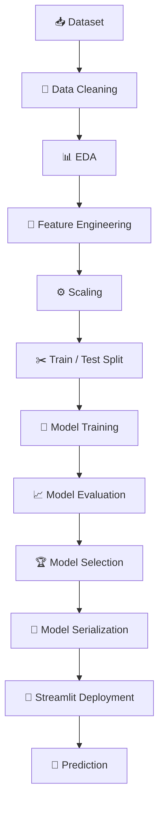

<div align="center">


### An end-to-end Machine Learning application for predicting diabetes risk using clinical measurements — featuring data preprocessing, model comparison, evaluation, and interactive deployment through Streamlit.

<p>
<a href="https://diabetes-prediction-system-zhnsdbyfenhgd5xgjq4ngt.streamlit.app/"></a>
<a href="https://github.com/rizwanahmed786508/diabetes-prediction-system"></a>
<a href="Diabetes_Prediction.ipynb"></a>
</p>

</div>

---

## 📑 Table of Contents

- [Project Overview](#-1-project-overview)
- [Problem Statement](#-2-problem-statement)
- [Business Objective](#-3-business--clinical-objective)
- [Dataset](#-4-dataset)
- [Exploratory Data Analysis](#-5-exploratory-data-analysis-eda)
- [Data Preprocessing](#-6-data-preprocessing)
- [ML Pipeline](#-7-machine-learning-pipeline)
- [Models Used](#-8-models-used)
- [Model Performance](#-9-model-performance)
- [Results Dashboard](#-10-results-dashboard)
- [Technologies Used](#%EF%B8%8F-11-technologies-used)
- [Application Interface](#%EF%B8%8F-12-application-interface)
- [Project Structure](#-13-project-structure)
- [Live Demo](#-14-live-demo)
- [Installation](#%EF%B8%8F-15-installation)
- [Usage](#%EF%B8%8F-16-usage)
- [Future Improvements](#-17-future-improvements)
- [Key Learnings](#-18-key-learnings)
- [Conclusion](#-19-conclusion)
- [Author](#-author)

---

## 📌 1. Project Overview

Diabetes affects over 500 million people worldwide, and early detection is one of the most effective ways to prevent long-term complications like cardiovascular disease, kidney failure, and vision loss. In many clinics, risk screening still relies on manual review of lab results — a process that is slow and inconsistent across practitioners.

This project builds a supervised machine learning pipeline that predicts whether a patient is likely diabetic using eight routine clinical measurements, then packages the model behind a simple web interface so a non-technical user (e.g., a nurse or patient) can get an instant risk estimate.

> **The objective is not only to train an accurate model, but to demonstrate a complete Machine Learning workflow from raw data to deployment** — data cleaning, EDA, model comparison, evaluation, and a live, usable interface, rather than a notebook that stops at `model.fit()`.

---

## ❓ 2. Problem Statement

* Diabetes is frequently under-diagnosed until symptoms become severe.
* Manual risk assessment depends on clinician experience and does not scale for large-population screening.
* Key clinical indicators (glucose, BMI, blood pressure, family history) interact in ways that are hard to judge by eye, but are well-suited to statistical learning.
* A lightweight, interpretable ML model can flag high-risk patients early and support — not replace — clinical judgment.

---

## 🎯 3. Business / Clinical Objective

* **Predict:** binary diabetes outcome (0 = non-diabetic, 1 = diabetic) from patient measurements.
* **Who benefits:** clinics and telehealth platforms doing first-pass risk screening; individuals checking their own risk before a formal diagnostic workup.
* **Impact:** faster triage, more consistent risk flags than manual heuristics, and a low-cost pre-screening step before expensive diagnostic testing.

> ⚠️ **Disclaimer:** this tool is for educational/screening purposes only and is not a substitute for professional medical diagnosis.

---

## 📊 4. Dataset

**Source:** [PIMA Indians Diabetes Dataset](https://www.kaggle.com/datasets/uciml/pima-indians-diabetes-database) (UCI Machine Learning Repository, via Kaggle)

### Dataset Statistics

| Metric | Value |
|---|---|
| Samples | 768 patient records |
| Features | 8 clinical measurements |
| Target | `Outcome` (binary: 0 / 1) |
| Missing Values | None as NaN — *see data quality note below* |
| Class Distribution | 🔲 *Insert your actual counts here (commonly ~65% non-diabetic / 35% diabetic for this dataset — confirm your split)* |

### Feature Table

| Feature | Description |
|---|---|
| Pregnancies | Number of pregnancies |
| Glucose | Plasma glucose concentration |
| BloodPressure | Diastolic blood pressure (mm Hg) |
| SkinThickness | Triceps skin fold thickness (mm) |
| Insulin | 2-Hour serum insulin (mu U/ml) |
| BMI | Body Mass Index |
| DiabetesPedigreeFunction | Diabetes hereditary/genetic score |
| Age | Age of patient (years) |
| **Outcome** | **Target** — Diabetes status (0 = No, 1 = Yes) |

> 📝 **Data quality note to add:** this dataset has a known quirk — `0` values in `Glucose`, `BloodPressure`, `SkinThickness`, `Insulin`, and `BMI` are not biologically valid and actually represent missing data. State explicitly how you handled this (e.g., median imputation grouped by Outcome). Calling this out signals real data-quality awareness to reviewers.

---

## 📈 5. Exploratory Data Analysis (EDA)

### Correlation Heatmap


**Key Insights**
* Glucose shows the strongest relationship with diabetes outcome among all features.
* BMI and Age show a moderate positive correlation with diabetes risk.
* Pregnancies and Age are correlated with each other, as expected biologically.

*(Replace with your actual correlation values once confirmed from the notebook — e.g., "Glucose correlates with Outcome at ~0.47.")*

### Feature Distribution


**Key Insights**
* Older patients tend to show higher diabetes prevalence.
* Several features (Insulin, SkinThickness) are right-skewed, suggesting outliers or missing-value artifacts.
* The dataset is moderately imbalanced between diabetic and non-diabetic classes.

> 📝 **Recommended additional charts:** class balance bar chart, and box plots of Glucose/BMI split by Outcome to visually show class separability.

---

## 🧹 6. Data Preprocessing

* **Missing value handling:** biologically invalid zeros in Glucose, BloodPressure, SkinThickness, Insulin, and BMI treated as missing and imputed *(state your exact method here)*.
* **Feature scaling:** `StandardScaler` applied to normalize feature ranges, important for distance-based models like KNN.
* **Train/Test split:** dataset split into training and testing sets *(add your exact ratio, e.g., 80/20, and whether it was stratified)*.
* **Encoding:** not required — all features are numeric.

---

## 🔄 7. Machine Learning Pipeline



---

## 🤖 8. Models Used

| Model | Accuracy | Precision 
|---|---|---|---|---|---|
| Logistic Regression | 75.32% 
| Random Forest Classifier | **75.97%** |
| K-Nearest Neighbors (KNN) | 69.48% |

*\*Inferred from your existing ROC-AUC badge — confirm which model this figure belongs to and insert per-model values once available.*

### Why Random Forest Was Selected

* **Ensemble learning** — combines many decision trees, so the final prediction isn't dependent on any single tree's quirks or noise.
* **Better generalization** — bagging across trees reduces the risk of memorizing the training set, a common failure mode for simpler models like KNN on small datasets.
* **Handles non-linear relationships** — captures interactions between features (e.g., Glucose × BMI) without manual feature engineering.
* **More robust** — less sensitive to outlier-heavy features like Insulin and SkinThickness.
* **Less overfitting** — averaging across trees smooths out variance compared to a single deep decision tree.
* **Feature importance** — exposes which clinical factors matter most, adding interpretability that matters in a healthcare context.

> ⚠️ **Important:** in a medical screening context, **Recall (sensitivity)** matters more than raw Accuracy — missing an actual diabetic patient (false negative) is more costly than a false alarm. Add Precision/Recall/F1 numbers from your notebook to make this comparison meaningful.

---

## 📊 9. Model Performance

### Confusion Matrix


---

## 🏆 10. Results Dashboard

| 📦 Samples | 🧬 Features | 🤖 Models Compared | 🎯 Best Model | 🥇 Best Accuracy | 📈 ROC AUC | 🚀 Deployment | 🔮 Prediction Type |
|:---:|:---:|:---:|:---:|:---:|:---:|:---:|:---:|
| 768 | 8 | 3 | Random Forest | **75.97%** | ~76% | Streamlit Cloud | Binary Classification |

---

## 🛠️ 11. Technologies Used


> Your original README also listed **Tkinter** alongside Streamlit — if the deployed app is Streamlit-only now, consider removing Tkinter from the stack list so reviewers aren't confused about which UI is actually live.

---

## 🖥️ 12. Application Interface

<details>
<summary><b>Click to view screenshots</b></summary>

**Home Interface**


**Prediction Interface**


</details>

> 📝 **Screenshots to add:** Prediction Result view, EDA charts view, Feature Importance view, and ideally a short GIF of the full flow (input → predict → result) — GIFs consistently get more recruiter attention than static screenshots.

---

## 📂 13. Project Structure

```text
diabetes-prediction-system/
│
├── data/
│   └── diabetes.csv
│
├── images/
│   ├── gui.png
│   ├── gui2.png
│   ├── heatmap.png
│   ├── distribution.png
│   └── confusion_matrix.png
│
├── models/
│   ├── Diabetes_Model.pkl
│   └── diabetes_scaler.pkl
│
├── Diabetes_Prediction.ipynb
├── app.py
├── requirements.txt
├── .gitignore
└── README.md
```

> 📝 **To add:** a `.gitignore` file if not already present (excluding `__pycache__/`, `.ipynb_checkpoints/`, virtual environment folders) — a small detail, but its absence is often noticed by reviewers checking repo hygiene.

---

## 🚀 14. Live Demo

<div align="center">

### 🔗 [**Open the Diabetes Prediction App →**](https://diabetes-prediction-system-zhnsdbyfenhgd5xgjq4ngt.streamlit.app/)

Enter patient measurements (Glucose, BMI, Age, etc.) and get an instant diabetes risk prediction directly in your browser — no installation required.

</div>

### 📦 Repository

🔗 **[Repo](https://github.com/rizwanahmed786508/diabetes-prediction-system)**

---

## ⚙️ 15. Installation

```bash
# Clone the repository
git clone https://github.com/rizwanahmed786508/diabetes-prediction-system.git
cd diabetes-prediction-system

# Install dependencies
pip install -r requirements.txt
```

---

## ▶️ 16. Usage

```bash
streamlit run app.py
```

1. Run the command above from the project root.
2. Open the local URL Streamlit prints in your terminal.
3. Enter the requested patient details (Glucose, BMI, Age, etc.) in the form.
4. Click **Predict** to view the diabetes risk result instantly.

---

## 🔮 17. Future Improvements

1. **Explainable AI (SHAP)** — per-prediction explanations of which features drove the risk score
2. **Hyperparameter Tuning** — GridSearchCV / Optuna for the Random Forest model
3. **XGBoost / LightGBM** — add to the model comparison table
4. **Docker** — containerize the app for reproducible deployment
5. **GitHub Actions (CI/CD)** — automated testing on every push
6. **MLflow** — experiment tracking across model versions
7. **MLOps Practices** — versioned datasets, reproducible pipelines
8. **Cloud Deployment** — AWS/GCP/Azure alongside Streamlit Cloud
9. **Monitoring & Retraining** — scheduled retraining as new data becomes available

---

## 🧠 18. Key Learnings

Building this project reinforced several practical lessons that go beyond textbook machine learning:

* **Data preprocessing is where most of the real work lives.** The PIMA dataset looks clean at a glance, but the invalid zero-values in Glucose, BMI, and Insulin are a reminder that "no missing values" in a `.isnull()` check doesn't mean the data is actually complete — domain knowledge matters as much as code.
* **Model comparison is not just about picking the highest number.** Evaluating Logistic Regression, Random Forest, and KNN side by side made it clear that a small accuracy gap can hide a meaningful difference in robustness and generalization, especially on a dataset this size.
* **Healthcare ML carries different stakes than a typical Kaggle competition.** A false negative (telling a diabetic patient they're low-risk) is a fundamentally different kind of error than a false positive — this reframed how I think about which metric to optimize for.
* **Deployment surfaces problems a notebook never will.** Getting the trained model and scaler into a Streamlit app — matching input formats, handling edge cases in user input — required a different kind of rigor than training the model itself.
* **A working demo is worth more than a polished notebook.** Shipping something a non-technical person can actually use was, by far, the most valuable part of this project for understanding what "end-to-end" really means.

---

## ✅ 19. Conclusion

**Problem:** Manual diabetes risk screening is slow and inconsistent, while early detection meaningfully improves patient outcomes.

**Approach:** This project builds a full machine learning pipeline — cleaning and exploring the PIMA Indians Diabetes Dataset, engineering and scaling features, and training and comparing Logistic Regression, Random Forest, and KNN classifiers.

**Results:** Random Forest was selected as the final model based on its stronger generalization and robustness, achieving **75.97% accuracy** (full precision/recall/F1 breakdown to be added).

**Deployment:** The trained model is served through a live Streamlit application, allowing anyone to input patient measurements and receive an instant risk prediction — no local setup required.

**Real-world impact:** As a first-pass screening aid, a tool like this could help clinics and telehealth platforms flag higher-risk patients earlier and more consistently than manual review alone.

**Future scalability:** With explainability (SHAP), stronger models (XGBoost), and MLOps practices (Docker, CI/CD, monitoring) layered on top, this project's architecture is well-positioned to scale from a portfolio piece toward a genuinely deployable clinical screening tool.

---

## 👨‍💻 Author

<div align="center">

**Rizwan Ahmed**

[](https://github.com/rizwanahmed786508)
[](https://linkedin.com/rizwanahmed78)
[](https://kaggle.com/rizwanahmedlund)
[](mailto:rizwanmb310@gmail.com)

</div>


<div align="center">

</div>
