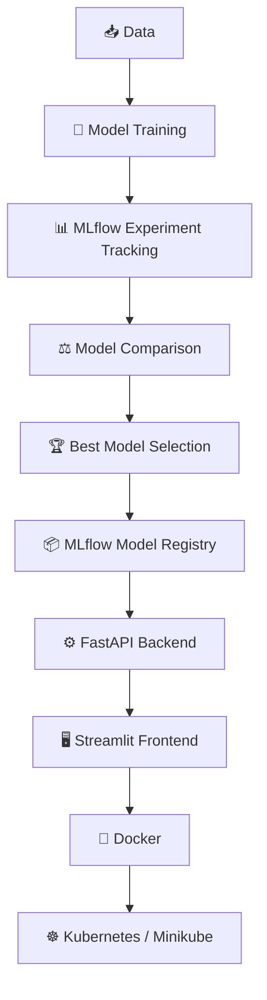

<div align="center">


### An end-to-end Machine Learning system for predicting diabetes risk — from experiment tracking and model registry (MLflow) to a containerized FastAPI + Streamlit application deployed on Kubernetes (Minikube).

<p>
<a href="https://github.com/rizwanahmed786508/diabetes-prediction-system"></a>
</p>

</div>

---

## 📑 Table of Contents

- [Overview](#-overview)
- [Key Features](#-key-features)
- [System Architecture](#-system-architecture)
- [Machine Learning Models](#-machine-learning-models)
- [Model Evaluation](#-model-evaluation)
- [MLflow Experiment Tracking](#-mlflow-experiment-tracking)
- [MLflow Model Registry](#-mlflow-model-registry)
- [Backend](#-backend-fastapi)
- [Frontend](#-frontend-streamlit)
- [Docker](#-docker)
- [Kubernetes / Minikube Deployment](#-kubernetes--minikube-deployment)
- [Project Structure](#-project-structure)
- [Installation / Setup](#%EF%B8%8F-installation--setup)
- [Running Locally](#-running-locally)
- [Running with Docker Compose](#-running-with-docker-compose)
- [Running with Minikube](#-running-with-minikube)
- [API Endpoints](#-api-endpoints)
- [Example Prediction](#-example-prediction)
- [Technologies Used](#%EF%B8%8F-technologies-used)
- [Future Improvements](#-future-improvements)
- [Author](#-author)

---

## 📌 Overview

Diabetes is one of the most common chronic conditions worldwide, and early risk screening can meaningfully improve patient outcomes. This project goes beyond a single training notebook and builds a **complete MLOps pipeline** around a diabetes risk classifier:

- Multiple models are trained and compared on clinical measurement data.
- Every training run is tracked in **MLflow**, and the best-performing model is automatically promoted to the **MLflow Model Registry**.
- A **FastAPI** backend serves predictions through a REST API.
- A **Streamlit** frontend gives users a simple interface that talks to the backend.
- Both services are **containerized with Docker** and orchestrated with **Docker Compose**.
- The full application is deployed and verified on a local **Kubernetes cluster (Minikube)**, with separate deployments and services for the backend and frontend.

> This project is intended to demonstrate the full lifecycle of a machine learning system — training, experiment tracking, model registry, API serving, containerization, and orchestration — not just a trained model.

---

## ⭐ Key Features

- ✅ Three-model comparison (Logistic Regression, Random Forest, KNN)
- ✅ Full evaluation suite: Accuracy, Precision, Recall, F1, Macro Precision/Recall/F1
- ✅ MLflow experiment tracking with logged parameters, metrics, and model artifacts
- ✅ Automatic best-model selection based on accuracy
- ✅ Model registered and versioned in the MLflow Model Registry with a `champion` alias
- ✅ FastAPI backend with `/predict` and `/health` endpoints and Pydantic input validation
- ✅ Streamlit frontend consuming the FastAPI backend
- ✅ Separate Docker images for backend and frontend, wired together with Docker Compose
- ✅ Kubernetes deployments and services for both backend and frontend, verified running on Minikube

---

## 🏗️ System Architecture


```mermaid
flowchart TD
    A[📥 Data] --> B[🤖 Model Training]
    B --> C[📊 MLflow Experiment Tracking]
    C --> D[⚖️ Model Comparison]
    D --> E[🏆 Best Model Selection]
    E --> F[📦 MLflow Model Registry]
    F --> G[⚙️ FastAPI Backend]
    G --> H[🖥️ Streamlit Frontend]
    H --> I[🐳 Docker]
    I --> J[☸️ Kubernetes / Minikube]
```

**Flow summary:** raw data is used to train three candidate models, every run is logged to MLflow, the highest-accuracy model is selected and registered in the MLflow Model Registry, the FastAPI backend serves predictions, the Streamlit frontend consumes the backend API, and both services are containerized with Docker and deployed to a local Kubernetes cluster via Minikube.

---

## 🤖 Machine Learning Models

Three models were trained and evaluated on the diabetes dataset:

- **Logistic Regression**
- **Random Forest**
- **K-Nearest Neighbors (KNN)**

Each model was evaluated using a full metric suite rather than accuracy alone, since the target classes are imbalanced.

---

## 📊 Model Evaluation

Each model was scored on:

- Accuracy
- Precision
- Recall
- F1-score
- Macro Precision
- Macro Recall
- Macro F1

The **current champion model is Random Forest, with an accuracy of 75.97%**, as selected automatically by the MLflow-based model comparison step described below.

---

## 🧪 MLflow Experiment Tracking

An MLflow Tracking Server runs through Docker and is used to track every training run.

- Parameters and evaluation metrics are logged for all three models (Logistic Regression, Random Forest, KNN).
- Model artifacts are logged for each run.
- After training, the model with the highest accuracy is automatically selected as the best model.

**Current best model (selected via MLflow):**

| Model | Accuracy |
|---|---|
| **Random Forest** | **75.97%** |

---

## 📦 MLflow Model Registry

The best-performing model is registered in the MLflow Model Registry:

- **Registered model name:** `DiabetesPredictionModel`
- **Version:** `1`
- **Alias:** `champion`

This gives the project a versioned, trackable record of which model is the current production candidate, independent of the training code itself.

---

## ⚙️ Backend (FastAPI)

The backend is built with **FastAPI** and exposes:

- **`/predict`** — accepts patient measurements and returns a diabetes prediction along with the model's probability output.
- **`/health`** — health check endpoint for monitoring/orchestration.

Input validation is handled with **Pydantic**, ensuring that malformed or out-of-range requests are rejected before reaching the model.

---

## 🖥️ Frontend (Streamlit)

The frontend is a **Streamlit** application that:

- Collects patient measurements through a simple form.
- Sends requests to the FastAPI backend's `/predict` endpoint.
- Displays the prediction result and probability returned by the backend.

The frontend does not perform prediction logic itself — all inference is delegated to the FastAPI backend.

---

## 🐳 Docker

The backend and frontend are containerized **separately**:

- `diabetes-backend` — FastAPI service image
- `diabetes-frontend` — Streamlit service image

**Docker Compose** is used to run both containers together, with the backend and frontend communicating over the Docker network.

---

## ☸️ Kubernetes / Minikube Deployment

The application has been deployed and verified on a **local Kubernetes cluster using Minikube** (Docker driver, Windows).

**Backend:**
- Deployment: `diabetes-backend`
- Service: `diabetes-backend-service` (ClusterIP)

**Frontend:**
- Deployment: `diabetes-frontend`
- Service: `diabetes-frontend-service` (NodePort)

**Verified status:**
- Backend pod reached `READY: 1/1`, `STATUS: Running`.
- Frontend was successfully accessed via `minikube service diabetes-frontend-service`.
- The application successfully produced live diabetes predictions through the Minikube deployment.

> 📝 Note: this project currently runs on **Minikube locally** — it has not been deployed to a cloud-managed Kubernetes cluster (e.g. EKS/GKE/AKS).

---

## 📂 Project Structure

```text
diabetes-prediction-system/
│
├── backend/
│   ├── app.py                # FastAPI app (/predict, /health)
│   ├── Dockerfile
│   └── requirements.txt
│
├── frontend/
│   ├── app.py                # Streamlit app
│   ├── Dockerfile
│   └── requirements.txt
│
├── k8s/
│   ├── backend-deployment.yaml
│   ├── backend-service.yaml
│   ├── frontend-deployment.yaml
│   └── frontend-service.yaml
│
├── mlflow/
│   └── (MLflow tracking config / experiment scripts)
│
├── models/
│   └── (serialized model artifacts)
│
├── docker-compose.yml
├── requirements.txt
└── README.md
```

> Adjust this tree to match your actual folder names if they differ — this reflects the components described above (FastAPI backend, Streamlit frontend, Kubernetes manifests, MLflow tracking).

---

## ⚙️ Installation / Setup

```bash
# Clone the repository
git clone https://github.com/rizwanahmed786508/diabetes-prediction-system.git
cd diabetes-prediction-system

# Install dependencies
pip install -r requirements.txt
```

---

## ▶️ Running Locally

**Backend (FastAPI):**
```bash
cd backend
uvicorn app:app --reload
```

**Frontend (Streamlit):**
```bash
cd frontend
streamlit run app.py
```

---

## 🐳 Running with Docker Compose

```bash
docker-compose up --build
```

This builds and starts the `diabetes-backend` and `diabetes-frontend` containers together, connected over the Docker network.

---

## ☸️ Running with Minikube

```bash
# Start Minikube
minikube start --driver=docker

# Apply Kubernetes manifests
kubectl apply -f k8s/backend-deployment.yaml
kubectl apply -f k8s/backend-service.yaml
kubectl apply -f k8s/frontend-deployment.yaml
kubectl apply -f k8s/frontend-service.yaml

# Check pod status
kubectl get pods

# Access the frontend
minikube service diabetes-frontend-service
```

---

## 🔌 API Endpoints

| Endpoint | Method | Description |
|---|---|---|
| `/health` | GET | Returns backend health status |
| `/predict` | POST | Accepts patient measurements, returns prediction + probability |

---

## 🔮 Example Prediction

```bash
curl -X POST "http://localhost:8000/predict" \
  -H "Content-Type: application/json" \
  -d '{
    "Pregnancies": 2,
    "Glucose": 130,
    "BloodPressure": 70,
    "SkinThickness": 25,
    "Insulin": 90,
    "BMI": 28.5,
    "DiabetesPedigreeFunction": 0.45,
    "Age": 33
  }'
```

> Field names above should match whatever your Pydantic input schema actually defines — update this example if your schema differs.

---

## 🛠️ Technologies Used


---

## 🔭 Future Improvements

- Integrate the FastAPI backend directly with the MLflow Model Registry so it loads the current `champion` alias at startup instead of a locally saved artifact.
- Add CI/CD (GitHub Actions) to automate build, test, and image publishing.
- Deploy to a managed cloud Kubernetes cluster (EKS/GKE/AKS) instead of local Minikube.
- Add Horizontal Pod Autoscaling and resource limits to the Kubernetes deployments.
- Add monitoring/observability (Prometheus + Grafana) for the deployed services.
- Add automated tests for the FastAPI endpoints.
- Explore hyperparameter tuning and additional models (XGBoost/LightGBM) within the MLflow tracking workflow.

---

## 👨‍💻 Author

⭐ If you found this project useful, please consider giving it a star.

<div align="center">

**Rizwan Ahmed**

[](https://github.com/rizwanahmed786508)
[](https://kaggle.com/rizwanahmedlund)
[](mailto:rizwanmb310@gmail.com)

</div>

<div align="center">

</div>
