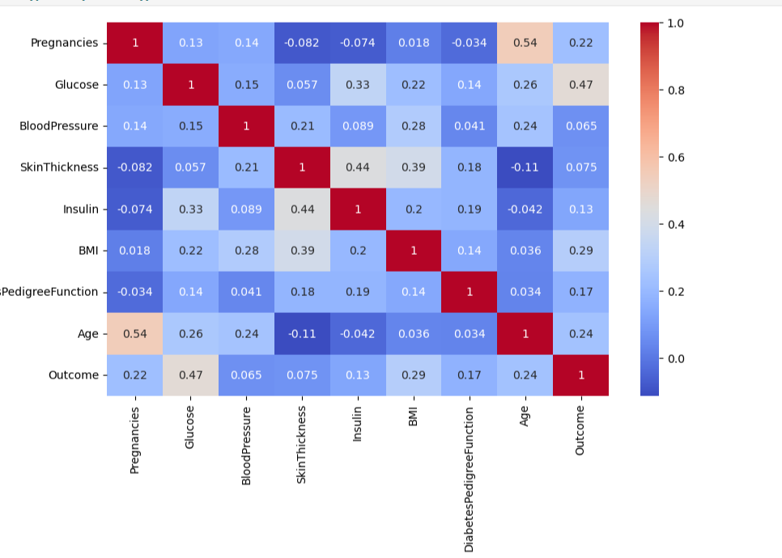
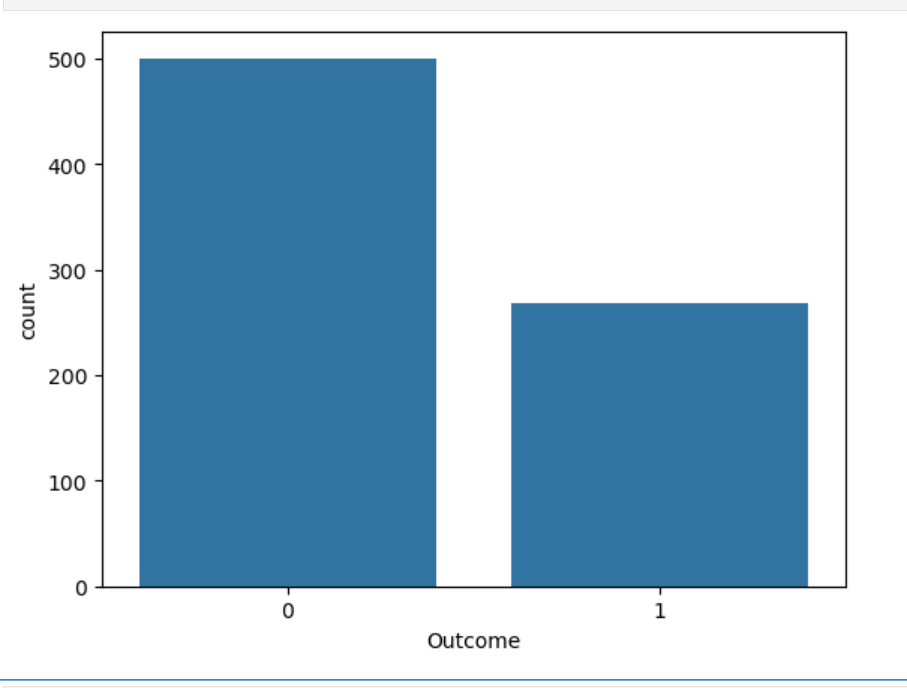
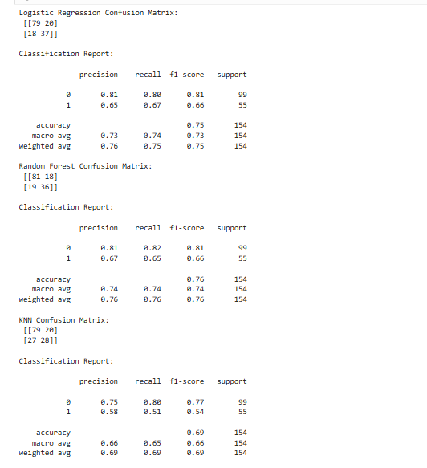
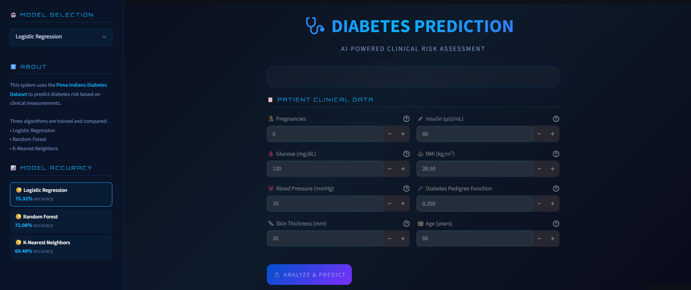
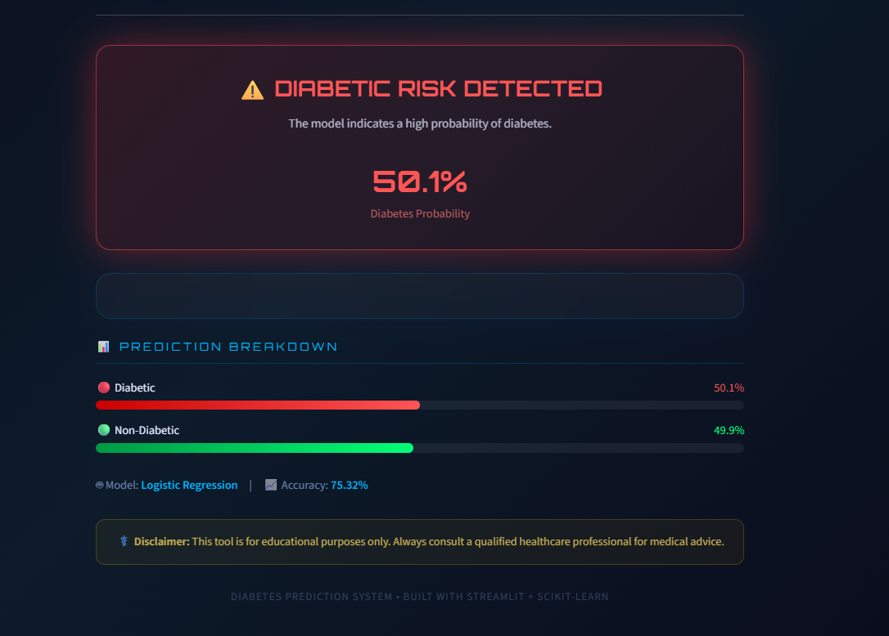

# 🩺 Diabetes Prediction System

**A machine learning system that predicts diabetes risk from routine clinical measurements — built end-to-end from raw data to a deployed, interactive web app.**

[🚀 Live Demo](https://diabetes-prediction-system-zhnsdbyfenhgd5xgjq4ngt.streamlit.app/) · [📂 Repository](https://github.com/rizwanahmed786508/diabetes-prediction-system) · [📓 Notebook](Diabetes_Prediction.ipynb)

---

## 📌 1. Project Overview

Diabetes affects over 500 million people worldwide, and early detection is one of the most effective ways to prevent long-term complications like cardiovascular disease, kidney failure, and vision loss. In many clinics, risk screening still relies on manual review of lab results — a process that is slow and inconsistent across practitioners.

This project builds a supervised machine learning pipeline that predicts whether a patient is likely diabetic using eight routine clinical measurements, then packages the model behind a simple web interface so a non-technical user (e.g., a nurse or patient) can get an instant risk estimate.

**Why this project:** it demonstrates a complete, deployable ML workflow — data cleaning, EDA, model comparison, evaluation, and deployment — rather than just a notebook that stops at `model.fit()`.

---

## ❓ 2. Problem Statement

* Diabetes is frequently under-diagnosed until symptoms become severe.
* Manual risk assessment depends on clinician experience and is not scalable for large-population screening.
* Key clinical indicators (glucose, BMI, blood pressure, family history) interact in ways that are hard to judge by eye, but are well-suited to statistical learning.
* A lightweight, interpretable ML model can flag high-risk patients early and support — not replace — clinical judgment.

---

## 🎯 3. Business / Clinical Objective

* **Predict:** binary diabetes outcome (0 = non-diabetic, 1 = diabetic) from patient measurements.
* **Who benefits:** clinics and telehealth platforms doing first-pass risk screening; individuals checking their own risk before a formal diagnostic workup.
* **Impact:** faster triage, more consistent risk flags than manual heuristics, and a low-cost pre-screening step before expensive diagnostic testing.

> ⚠️ **Disclaimer:** this tool is for educational/screening purposes only and is not a substitute for professional medical diagnosis.

---

## 📊 4. Dataset

**Source:** [PIMA Indians Diabetes Dataset](https://www.kaggle.com/datasets/uciml/pima-indians-diabetes-database) (UCI Machine Learning Repository, via Kaggle)

| Property | Detail |
|---|---|
| Rows | 768 patient records |
| Columns | 8 features + 1 target |
| Target variable | `Outcome` (0 = No Diabetes, 1 = Diabetes) |
| Population | Female patients of Pima Indian heritage, age 21+ |

### Feature Description

| Feature | Description |
|---|---|
| Pregnancies | Number of pregnancies |
| Glucose | Plasma glucose concentration |
| BloodPressure | Diastolic blood pressure (mm Hg) |
| SkinThickness | Triceps skin fold thickness (mm) |
| Insulin | 2-Hour serum insulin (mu U/ml) |
| BMI | Body Mass Index |
| DiabetesPedigreeFunction | Diabetes hereditary/genetic score |
| Age | Age of patient (years) |
| **Outcome** | **Target** — Diabetes status (0 = No, 1 = Yes) |

**📝 To add:** a short note on data quality — e.g., known issue in this dataset where `0` values in `Glucose`, `BloodPressure`, `SkinThickness`, `Insulin`, and `BMI` actually represent missing data, and how you handled that (imputation, median fill, etc.). Stating this explicitly signals real data-quality awareness to reviewers.

---

## 📈 5. Exploratory Data Analysis (EDA)

### Correlation Heatmap


### Feature Distribution


**📝 Recommended additions** (mention these are coming, or add them if already in your notebook):
- Class balance bar chart (diabetic vs. non-diabetic counts) — this dataset is known to be imbalanced (~65/35), which is worth stating explicitly since it affects how Recall should be interpreted.
- Box plots of Glucose/BMI split by Outcome, to visually show separability.
- One or two sentence "key insight" callouts under each chart (e.g., "Glucose shows the strongest correlation with Outcome at ~0.47").

---

## 🧹 6. Data Preprocessing

* **Missing value handling:** biologically invalid zeros in Glucose, BloodPressure, SkinThickness, Insulin, and BMI treated as missing and imputed *(state your exact method — median/mean by class — here)*.
* **Feature scaling:** `StandardScaler` applied to normalize feature ranges, important for distance-based models like KNN.
* **Train/Test split:** dataset split into training and testing sets *(add your exact ratio, e.g., 80/20, and whether it was stratified)*.
* **Encoding:** not required — all features are numeric.

---

## 🔄 7. Machine Learning Pipeline

```text
Raw Data (PIMA CSV)
        │
        ▼
Data Cleaning (handle invalid zeros)
        │
        ▼
Exploratory Data Analysis
        │
        ▼
Feature Scaling (StandardScaler)
        │
        ▼
Train / Test Split
        │
        ▼
Model Training (LogReg, Random Forest, KNN)
        │
        ▼
Model Evaluation (Accuracy, Precision, Recall, F1)
        │
        ▼
Model & Scaler Serialization (joblib)
        │
        ▼
Streamlit Deployment
```

---

## 🤖 8. Models Used

| Model | Accuracy |
|---|---|
| Logistic Regression | 75.32% |
| Random Forest Classifier | 75.97% |
| K-Nearest Neighbors (KNN) | 69.48% |

**Why Random Forest was selected (not just "highest accuracy"):** as an ensemble of decision trees, Random Forest averages out the variance of any single tree, which tends to make it more robust to the noise and outliers present in clinical data like Insulin and SkinThickness. It also naturally captures non-linear interactions between features (e.g., Glucose × BMI) without manual feature engineering, and it exposes feature importances that add interpretability — valuable in a healthcare context where "why" matters as much as "what."

**📝 To strengthen this section:** add Precision, Recall, and F1-Score columns to the table above. In a medical screening context, **Recall (sensitivity)** matters more than raw accuracy — missing an actual diabetic patient (false negative) is more costly than a false alarm. If your notebook has these numbers, include them; if not, they're a quick addition that meaningfully strengthens the project's credibility.

---

## 📊 9. Model Performance

### Confusion Matrix


**In plain English:** the confusion matrix shows how many patients were correctly vs. incorrectly classified in each outcome class. *(Add 1–2 sentences here once you have exact numbers, e.g., "The model correctly identified X% of diabetic patients while keeping false positives low.")*

**📝 Recommended additions:**
- Classification report (Precision/Recall/F1 per class)
- ROC curve with AUC score (you already advertise ROC-AUC 76% in the badge — showing the actual curve backs that number up visually)
- Feature importance plot from the Random Forest model — this is often the single most "hire-me" chart in a healthcare ML project, since it shows which clinical factors drive risk

---

## 🛠️ 10. Technologies Used


> Your original README also listed **Tkinter** as a GUI library alongside Streamlit — if the deployed app is Streamlit-only now, consider removing Tkinter from the stack list to avoid confusing reviewers about which UI is actually live.

---

## 🖥️ 11. Application Interface

<details>
<summary><b>Click to view GUI screenshots</b></summary>




</details>

---

## 📂 12. Project Structure

```text
diabetes-prediction-system/
│
├── data/
│   └── diabetes.csv
│
├── images/
│   ├── gui.png
│   ├── gui2.png
│   ├── heatmap.png
│   ├── distribution.png
│   └── confusion_matrix.png
│
├── models/
│   ├── Diabetes_Model.pkl
│   └── diabetes_scaler.pkl
│
├── Diabetes_Prediction.ipynb
├── app.py
├── requirements.txt
└── README.md
```

---

## 🚀 13. Live Demo

🔗 **[Open the Diabetes Prediction App](https://diabetes-prediction-system-zhnsdbyfenhgd5xgjq4ngt.streamlit.app/)**

Enter patient measurements (Glucose, BMI, Age, etc.) and get an instant diabetes risk prediction in your browser — no installation required.

---

## 📦 14. Repository

🔗 **[github.com/rizwanahmed786508/diabetes-prediction-system](https://github.com/rizwanahmed786508/diabetes-prediction-system)**

---

## ⚙️ 15. Installation

```bash
# Clone the repository
git clone https://github.com/rizwanahmed786508/diabetes-prediction-system.git
cd diabetes-prediction-system

# Install dependencies
pip install -r requirements.txt
```

---

## ▶️ 16. Usage

```bash
streamlit run app.py
```

Then open the local URL Streamlit prints in your terminal, enter the requested patient details in the form, and click **Predict** to view the diabetes risk result.

---

## 🔮 17. Future Improvements

* [ ] SHAP explainability for individual predictions
* [ ] Hyperparameter tuning (GridSearchCV / Optuna)
* [ ] Add XGBoost / LightGBM to model comparison
* [ ] Address class imbalance (SMOTE or class-weighting)
* [ ] Docker containerization for reproducible deployment
* [ ] CI/CD pipeline (GitHub Actions) for automated testing
* [ ] Cloud deployment (AWS/GCP/Azure) alongside Streamlit Cloud
* [ ] Model monitoring & scheduled retraining on new data
* [ ] Improved UI/UX design

---

## 🧠 18. Key Learnings

*(Write 3–5 sentences in your own words — this section matters a lot for internship/scholarship reviewers, since it shows self-reflection. Example prompts to answer: What was the hardest part of this project? What would you do differently? What ML concept clicked for you while building this?)*

---

## ✅ 19. Conclusion

This project demonstrates a complete, deployable machine learning workflow for diabetes risk prediction — from raw clinical data to a live, interactive web application. The Random Forest model achieves **~76% accuracy**, providing a solid baseline for a first-pass screening tool. With the recommended additions above (class balance handling, feature importance, SHAP explainability), this project can move from a strong portfolio piece to a genuinely production-aware case study.

---

## 👨‍💻 Author

**Rizwan Ahmed**
[GitHub](https://github.com/rizwanahmed786508) · *(add LinkedIn / email / portfolio link here — recruiters actively look for this)*
