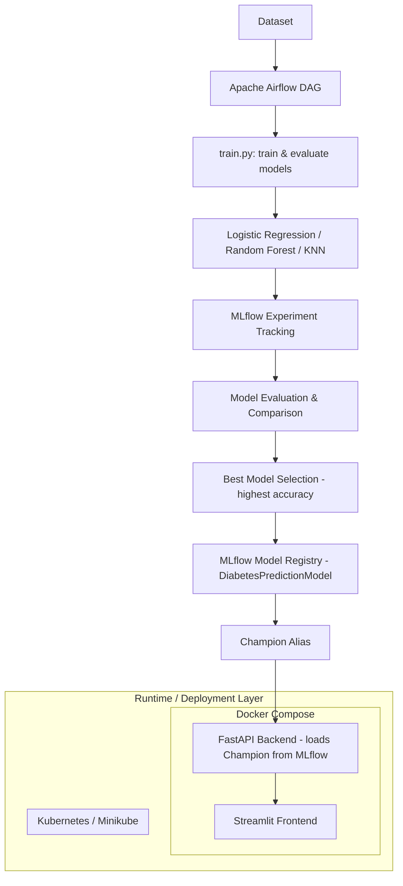

<div align="center">


### An end-to-end automated MLOps system that orchestrates model training with Apache Airflow, tracks experiments and manages model versions with MLflow, automatically promotes the best-performing model as the Champion, serves the registered model through FastAPI, provides a Streamlit interface, and deploys the application using Docker and Kubernetes/Minikube.

<p>
<a href="https://github.com/rizwanahmed786508/diabetes-prediction-system"></a>
</p>

</div>

---

## Table of Contents

- [Project Overview](#project-overview)
- [Why This Is an MLOps Project](#why-this-is-an-mlops-project)
- [Key Features](#key-features)
- [End-to-End MLOps Workflow](#end-to-end-mlops-workflow)
- [System Architecture](#system-architecture)
- [Architecture Components](#architecture-components)
  - [Apache Airflow](#apache-airflow)
  - [Training Pipeline — train.py](#training-pipeline--trainpy)
  - [MLflow Experiment Tracking](#mlflow-experiment-tracking)
  - [MLflow Model Registry](#mlflow-model-registry)
  - [Champion Model Strategy](#champion-model-strategy)
  - [FastAPI Serving Layer](#fastapi-serving-layer)
  - [Streamlit Frontend](#streamlit-frontend)
  - [Docker / Docker Compose](#docker--docker-compose)
  - [Kubernetes / Minikube](#kubernetes--minikube)
- [Machine Learning Pipeline](#machine-learning-pipeline)
- [Model Evaluation](#model-evaluation)
- [Technology Stack](#technology-stack)
- [Project Structure](#project-structure)
- [Installation / Prerequisites](#installation--prerequisites)
- [Running the MLOps Pipeline](#running-the-mlops-pipeline)
- [Running with Docker Compose](#running-with-docker-compose)
- [Running with Minikube](#running-with-minikube)
- [API Endpoints](#api-endpoints)
- [Example Prediction](#example-prediction)
- [End-to-End Workflow Example](#end-to-end-workflow-example)
- [Current Implementation / Verification](#current-implementation--verification)
- [Future Improvements](#future-improvements)
- [Author](#author)
- [License](#license)

---

## Project Overview

Diabetes is one of the most common chronic conditions worldwide, and early risk screening can meaningfully improve patient outcomes. This repository implements that screening model not as a single notebook, but as a **fully automated MLOps system** covering the entire ML lifecycle: orchestrated training, experiment tracking, model registry, automated promotion, API serving, and containerized/orchestrated deployment.

Training is triggered and executed through an **Apache Airflow DAG**, every run is tracked in **MLflow**, the best-performing model is automatically registered and promoted to a `champion` alias in the **MLflow Model Registry**, and a **FastAPI** backend loads that champion model directly from the registry to serve predictions to a **Streamlit** frontend. The application runs in containers via **Docker Compose** and has also been deployed and verified on **Kubernetes (Minikube)**.

---

## Why This Is an MLOps Project

This project is intentionally structured around the core pillars of MLOps rather than being a standalone prediction script wrapped in a UI:

| MLOps Concern | How It's Addressed |
|---|---|
| Workflow orchestration | Apache Airflow DAG triggers and executes the training pipeline — no manual training runs |
| Reproducibility & traceability | Every run's parameters, metrics, and artifacts are logged to MLflow |
| Model versioning | Every registered model gets a version number in the MLflow Model Registry |
| Model promotion | The best model is automatically promoted to the `champion` alias — a defined, repeatable process |
| Model serving | FastAPI loads the `champion` model directly from the MLflow Model Registry, not a manually copied file |
| Containerization | Backend and frontend run as independent Docker images |
| Service orchestration / deployment | Docker Compose for local multi-service runtime; Kubernetes (Minikube) for orchestrated deployment |

The result is a pipeline where **training, tracking, registration, and serving are connected stages of one system**, not disconnected manual steps.

---

## Key Features

- Automated ML pipeline orchestration via an **Apache Airflow DAG** that executes `train.py`
- Multi-model training and comparison: Logistic Regression, Random Forest, K-Nearest Neighbors
- Full evaluation suite per model: Accuracy, Precision, Recall, F1, Macro Precision/Recall/F1
- Automatic best-model selection based on accuracy — no manual model selection
- Automatic registration and versioning in the **MLflow Model Registry**, with `champion` alias promotion
- **FastAPI** backend that loads the `champion` model directly from the MLflow Model Registry at runtime, exposing `/predict` and `/health`
- Pydantic-based request validation on the API layer
- **Streamlit** frontend that consumes the FastAPI backend only — no inference logic in the UI
- Independent Docker images for backend and frontend, orchestrated with **Docker Compose**
- Kubernetes Deployments and Services for backend and frontend, verified running on **Minikube**

---

## End-to-End MLOps Workflow

**Train → Track → Evaluate → Register → Promote → Serve → Consume**

| Stage | Technology | What Happens |
|---|---|---|
| **Train** | Apache Airflow → `train.py` | DAG triggers `train.py`, which trains multiple candidate models |
| **Track** | MLflow Tracking | Parameters, metrics, and artifacts are logged for every run |
| **Evaluate** | `train.py` + MLflow | Models are compared on accuracy and related metrics |
| **Register** | MLflow Model Registry | The best-performing model is registered as a new version of `DiabetesPredictionModel` |
| **Promote** | MLflow Model Registry | The new version is promoted to the `champion` alias |
| **Serve** | FastAPI | The backend loads the `champion` model directly from the registry and exposes `/predict` |
| **Consume** | Streamlit | The frontend collects input, calls the FastAPI API, and displays the result |

This same **Train → Serve** flow runs identically whether the application is executed via Docker Compose or deployed on Kubernetes/Minikube — those two only change *how the services run*, not *how the model is trained or promoted*.

---

## System Architecture


```mermaid
flowchart TD
    A[Dataset] --> B["Apache Airflow DAG"]
    B --> C["train.py: train & evaluate models"]
    C --> D["Logistic Regression / Random Forest / KNN"]
    D --> E["MLflow Experiment Tracking"]
    E --> F["Model Evaluation & Comparison"]
    F --> G["Best Model Selection - highest accuracy"]
    G --> H["MLflow Model Registry - DiabetesPredictionModel"]
    H --> I["Champion Alias"]
    I --> J["FastAPI Backend - loads Champion from MLflow"]
    J --> K["Streamlit Frontend"]

    subgraph RUNTIME["Runtime / Deployment Layer"]
        subgraph COMPOSE["Docker Compose"]
            J
            K
        end
        subgraph K8S["Kubernetes / Minikube"]
            J
            K
        end
    end
```

**How to read this diagram:** Airflow and `train.py` handle **ML workflow orchestration** — they are responsible for producing a registered, promoted model. MLflow handles **experiment tracking and model lifecycle management** — it is the source of truth for which model version is `champion`. FastAPI and Streamlit form the **serving/consumption layer**. Docker Compose and Kubernetes/Minikube are the **application runtime/deployment layer** — they run the already-built FastAPI and Streamlit containers, they do not perform training or model selection themselves.

---

## Architecture Components

### Apache Airflow

Apache Airflow is the **ML workflow orchestration layer** of this project — not just a scheduler bolted on afterward. An Airflow DAG is responsible for executing the training pipeline end-to-end:

```
Airflow DAG → train.py → model training/evaluation → MLflow tracking → best model selection → model registration/champion promotion
```

Because the DAG owns this flow, training is no longer a manual notebook process — it is a defined, repeatable pipeline that can be triggered and re-run consistently, with each run producing a fully tracked and (if it's the best run) promoted model.

### Training Pipeline — train.py

`train.py` is the core training script executed by the Airflow DAG. It:

- Loads and prepares the dataset
- Trains multiple candidate models (Logistic Regression, Random Forest, KNN)
- Evaluates each model on a consistent metric suite
- Logs parameters, metrics, and artifacts to MLflow for every run
- Compares model performance and identifies the best-performing model
- Registers the selected model in the MLflow Model Registry
- Updates/promotes the `champion` alias to point to that model version

**Relationship:** Airflow orchestrates → `train.py` executes → MLflow tracks and manages the resulting models.

### MLflow Experiment Tracking

MLflow is the experiment tracking layer. Every run triggered by the Airflow DAG logs:

- Parameters used for each model
- Evaluation metrics (Accuracy, Precision, Recall, F1, Macro Precision/Recall/F1)
- Model artifacts
- Run-level metadata

From an MLOps perspective, this matters because it provides:

- **Reproducibility** — any past run can be inspected and compared exactly as it was logged
- **Experiment comparison** — runs across models and configurations are directly comparable
- **Traceability** — the lineage from dataset → training run → registered model is preserved
- **Model lifecycle management** — MLflow becomes the single source of truth for what was trained, when, and how it performed

### MLflow Model Registry

The registered model is:

```
DiabetesPredictionModel
```

The MLflow Model Registry is used for:

- **Model versioning** — every promoted training run becomes a new, immutable version
- **Model lifecycle management** — versions are tracked independently of the training code
- **Identifying the production candidate** — via the `champion` alias
- **Maintaining the `champion` alias** — updated automatically as part of the Airflow-orchestrated pipeline

The FastAPI backend consumes the **MLflow `champion` model directly**, rather than relying on a manually copied model file. This is a core architectural decision of the project: the serving layer is decoupled from the training code and depends only on the registry.

### Champion Model Strategy

The Champion strategy gives the project a stable, well-defined way to promote models to production:

```
New training run
  → models evaluated
  → best model identified
  → registered as a new model version
  → champion alias updated
  → serving layer loads champion
```

The `champion` alias provides a **stable reference** to the currently selected production model, while allowing the underlying model version behind that alias to change over time as new training runs are evaluated. This project implements alias-based promotion only — it does not implement automated rollback, canary deployment, A/B testing, or approval workflows.

### FastAPI Serving Layer

FastAPI is the model-serving and API layer. It:

- Exposes a `/predict` endpoint for inference
- Exposes a `/health` endpoint for health checks
- Validates incoming request data with **Pydantic** before it reaches the model
- Loads the **Champion model directly from the MLflow Model Registry** at runtime
- Returns the prediction (and probability, where applicable) through the REST API

**Architecture:** `Streamlit → FastAPI → Champion Model (loaded from MLflow)`

The frontend never performs inference itself — all model logic lives behind the FastAPI layer.

### Streamlit Frontend

Streamlit is purely the user-facing interface. It:

- Collects patient input through a simple form
- Sends the request to the FastAPI backend
- Displays the prediction result
- Displays the prediction probability
- Can display information about the current Champion model

In Docker Compose, the frontend communicates with the backend using the Compose service name — `http://backend:8000` — rather than `localhost`, since each container runs in its own network namespace and `localhost` inside the frontend container would not reach the backend container.

### Docker / Docker Compose

Containerization is part of the deployment architecture, with separate images/services for:

- **Backend** (FastAPI)
- **Frontend** (Streamlit)

Docker Compose provides:

- Service orchestration for local, multi-container runtime
- Internal networking between backend and frontend
- A reproducible local deployment environment

**Networking:** inside Docker Compose, the frontend reaches the backend at `http://backend:8000` over the internal Docker network, while the backend is exposed externally on port `8000` and the frontend on port `8501`.

### Kubernetes / Minikube

Minikube is used as a **local Kubernetes deployment and testing environment** (Docker driver). This is explicitly a local Kubernetes deployment — not a managed cloud Kubernetes cluster.

- **Backend:** Kubernetes Deployment `diabetes-backend`, Service `diabetes-backend-service` (ClusterIP)
- **Frontend:** Kubernetes Deployment `diabetes-frontend`, Service `diabetes-frontend-service` (NodePort)
- The application was deployed to Minikube and verified: the backend pod reached `READY: 1/1`, `STATUS: Running`, and the frontend was successfully accessed via `minikube service diabetes-frontend-service`, producing live predictions.

---

## Machine Learning Pipeline

Three models are trained and evaluated on the diabetes dataset as part of the `train.py` pipeline:

- **Logistic Regression**
- **Random Forest**
- **K-Nearest Neighbors (KNN)**

All three are trained and evaluated consistently within the same pipeline run, and the best-performing model is selected **automatically** based on accuracy — model selection is not a manual step.

---

## Model Evaluation

Each model is scored on a full metric suite rather than accuracy alone, since the target classes are imbalanced:

- Accuracy
- Precision
- Recall
- F1-score
- Macro Precision
- Macro Recall
- Macro F1

**Current best-performing model (selected automatically and promoted to Champion):**

| Model | Accuracy |
|---|---|
| **Random Forest** | **75.97%** |

---

## Technology Stack

| Layer | Technology | Role |
|---|---|---|
| Workflow orchestration | Apache Airflow | Orchestrates and triggers the training pipeline |
| Modeling | Scikit-learn (Logistic Regression, Random Forest, KNN) | Candidate models |
| Experiment tracking & registry | MLflow | Tracks runs, manages versions, maintains `champion` alias |
| Backend API | FastAPI, Pydantic | Serves the Champion model, validates requests |
| Frontend | Streamlit | User-facing interface |
| Containerization | Docker, Docker Compose | Packages and runs backend/frontend services |
| Deployment orchestration | Kubernetes (Minikube, Docker driver) | Local orchestrated deployment |
| Language | Python 3.8+ | Core implementation language |

---

## Project Structure

```text
diabetes-prediction-system/
│
├── dags/
│   └── (Airflow DAG definition triggering train.py)
│
├── backend/
│   ├── app.py                # FastAPI app (/predict, /health) — loads Champion from MLflow
│   ├── Dockerfile
│   └── requirements.txt
│
├── frontend/
│   ├── app.py                # Streamlit app
│   ├── Dockerfile
│   └── requirements.txt
│
├── k8s/
│   ├── backend-deployment.yaml
│   ├── backend-service.yaml
│   ├── frontend-deployment.yaml
│   └── frontend-service.yaml
│
├── mlflow/
│   └── (MLflow tracking config / experiment scripts)
│
├── train.py                  # Core training/evaluation/registration script, executed by Airflow
├── docker-compose.yml
├── requirements.txt
└── README.md
```

> Update this tree if your actual folder/file names differ — it reflects the Airflow DAG, training script, FastAPI backend, Streamlit frontend, Kubernetes manifests, and MLflow components described above.

---

## Installation / Prerequisites

**Prerequisites:** Python 3.8+, Docker Desktop, Apache Airflow (for running the training DAG), Minikube (for Kubernetes deployment), Git.

```bash
# Clone the repository
git clone https://github.com/rizwanahmed786508/diabetes-prediction-system.git
cd diabetes-prediction-system

# Install dependencies
pip install -r requirements.txt
```

---

## Running the MLOps Pipeline

Training is executed through the Airflow DAG rather than run manually:

```bash
# Start Airflow (webserver + scheduler, per your Airflow setup)
airflow webserver
airflow scheduler

# Trigger the DAG that executes train.py
airflow dags trigger <dag_id>
```

Once the DAG run completes, the results are visible in the MLflow UI, and the best-performing run is registered and promoted to the `champion` alias of `DiabetesPredictionModel`.

```bash
# View experiment tracking / registry
mlflow ui
```

---

## Running with Docker Compose

```bash
docker-compose up --build
docker compose ps
docker compose logs -f
docker compose down
```

This builds and starts the `diabetes-backend` and `diabetes-frontend` containers together, connected over the internal Docker network, with the backend loading the current Champion model from MLflow at startup.

---

## Running with Minikube

```bash
# Start Minikube
minikube start --driver=docker

# Apply Kubernetes manifests
kubectl apply -f k8s/backend-deployment.yaml
kubectl apply -f k8s/backend-service.yaml
kubectl apply -f k8s/frontend-deployment.yaml
kubectl apply -f k8s/frontend-service.yaml

# Check pod status
kubectl get pods

# Access the frontend
minikube service diabetes-frontend-service
```

---

## API Endpoints

| Endpoint | Method | Description |
|---|---|---|
| `/health` | GET | Returns backend health status |
| `/predict` | POST | Accepts patient measurements, returns prediction + probability from the Champion model |

---

## Example Prediction

```bash
curl -X POST "http://localhost:8000/predict" \
  -H "Content-Type: application/json" \
  -d '{
    "Pregnancies": 2,
    "Glucose": 130,
    "BloodPressure": 70,
    "SkinThickness": 25,
    "Insulin": 90,
    "BMI": 28.5,
    "DiabetesPedigreeFunction": 0.45,
    "Age": 33
  }'
```

> Field names should match your Pydantic input schema exactly — update this example if your schema differs.

---

## End-to-End Workflow Example

1. The Airflow DAG is triggered (manually or on schedule) and starts `train.py`.
2. `train.py` trains and evaluates Logistic Regression, Random Forest, and KNN, logging each run to MLflow.
3. The pipeline identifies Random Forest as the best-performing model (75.97% accuracy) and registers it as a new version of `DiabetesPredictionModel`.
4. The `champion` alias is updated to point to this new version.
5. The FastAPI backend, on startup or next model refresh, loads the `champion` model directly from the MLflow Model Registry.
6. A user submits patient data through the Streamlit frontend.
7. Streamlit sends the request to `POST /predict` on the FastAPI backend.
8. FastAPI validates the request with Pydantic, runs inference using the Champion model, and returns the prediction and probability.
9. Streamlit displays the result to the user.

---

## Current Implementation / Verification

- ✅ Airflow DAG triggers `train.py` and orchestrates the full training-to-registration flow
- ✅ MLflow tracks parameters, metrics, and artifacts for every run
- ✅ Best model is automatically registered and promoted to the `champion` alias of `DiabetesPredictionModel`
- ✅ FastAPI loads the Champion model directly from the MLflow Model Registry (no local `.pkl` serving)
- ✅ Backend and frontend run together via Docker Compose
- ✅ Backend and frontend deployed and verified on Kubernetes via Minikube (pod `READY: 1/1`, frontend reachable, live predictions confirmed)

---

## Future Improvements

- Add CI/CD (e.g. GitHub Actions) to automate build, test, and image publishing
- Deploy to a managed cloud Kubernetes cluster (EKS/GKE/AKS) instead of local Minikube
- Add Horizontal Pod Autoscaling and resource limits to the Kubernetes deployments
- Add monitoring/observability (e.g. Prometheus + Grafana) for the deployed services
- Add automated tests for the FastAPI endpoints and the Airflow DAG
- Explore hyperparameter tuning and additional models (XGBoost/LightGBM) within the MLflow tracking workflow
- Add scheduled or data-driven retraining triggers in Airflow, and model drift detection to decide when retraining is needed
- Add automated rollback/approval workflow around Champion promotion

---

## Author

⭐ If you found this project useful, please consider giving it a star.

<div align="center">

**Rizwan Ahmed**

[](https://github.com/rizwanahmed786508)
[](https://kaggle.com/rizwanahmedlund)
[](mailto:rizwanmb310@gmail.com)

</div>

## License

This project is licensed under the MIT License.

<div align="center">

</div>
