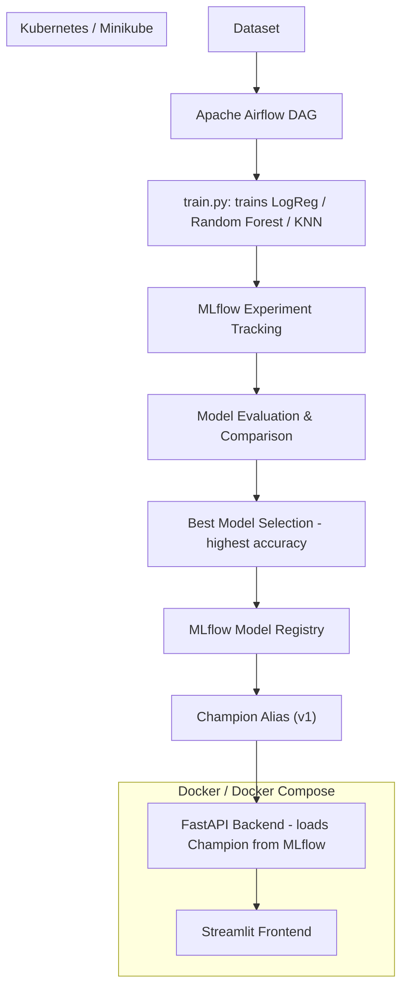

<div align="center">


### An end-to-end automated MLOps pipeline that trains multiple machine learning models using Apache Airflow, tracks experiments and manages model versions with MLflow, automatically promotes the best model as the Champion, and serves it through a containerized FastAPI + Streamlit application deployed with Docker Compose and Kubernetes/Minikube.

<p>
<a href="https://github.com/rizwanahmed786508/diabetes-prediction-system"></a>
</p>

</div>

---

## Table of Contents

- [Overview](#overview)
- [Key Features](#key-features)
- [Problem Statement](#problem-statement)
- [System Architecture](#system-architecture)
- [Technology Stack](#technology-stack)
- [Apache Airflow Automation](#apache-airflow-automation)
- [Machine Learning Pipeline](#machine-learning-pipeline)
- [MLflow Experiment Tracking](#mlflow-experiment-tracking)
- [MLflow Model Registry & Champion Strategy](#mlflow-model-registry--champion-strategy)
- [Backend — FastAPI](#backend--fastapi)
- [Frontend — Streamlit](#frontend--streamlit)
- [Docker & Docker Compose](#docker--docker-compose)
- [Kubernetes / Minikube Deployment](#kubernetes--minikube-deployment)
- [Project Structure](#project-structure)
- [Installation / Setup](#installation--setup)
- [Running Locally](#running-locally)
- [Running with Docker Compose](#running-with-docker-compose)
- [Running with Minikube](#running-with-minikube)
- [API Endpoints](#api-endpoints)
- [Example Prediction](#example-prediction)
- [Future Improvements](#future-improvements)
- [Author](#author)

---

## Overview

Diabetes is one of the most common chronic conditions worldwide, and early risk screening can meaningfully improve patient outcomes. This project goes beyond a single training notebook and implements a **complete, automated MLOps pipeline** around a diabetes risk classifier:

- **Apache Airflow** orchestrates and automates the training pipeline end-to-end — training is no longer a manual step.
- `train.py` is executed by the Airflow DAG and automatically trains and compares multiple models.
- Every training run is tracked in **MLflow**, and the best-performing model is automatically registered and promoted to the **MLflow Model Registry** under a `champion` alias.
- A **FastAPI** backend loads the `champion` model directly from the MLflow Model Registry at runtime and serves predictions through a REST API — there is no local `.pkl` file being served.
- A **Streamlit** frontend gives users a simple interface that talks to the backend.
- Backend and frontend are **containerized with Docker** and run together with **Docker Compose**.
- The full application is also deployed and verified on a local **Kubernetes cluster (Minikube)**, with separate deployments and services for the backend and frontend.

> This project demonstrates the full lifecycle of a machine learning system — automated training, experiment tracking, model registry, API serving, containerization, and orchestration — not just a trained model in a notebook.

---

## Key Features

- **Automated pipeline orchestration with Apache Airflow** — a DAG triggers `train.py`, removing the need for manual training runs
- Three-model comparison: Logistic Regression, Random Forest, and K-Nearest Neighbors
- Full evaluation suite: Accuracy, Precision, Recall, F1, Macro Precision/Recall/F1
- MLflow experiment tracking with logged parameters, metrics, and model artifacts for every run
- Automatic best-model selection based on accuracy
- Model automatically registered and versioned in the MLflow Model Registry with a `champion` alias
- FastAPI backend that loads the `champion` model **directly from the MLflow Model Registry at runtime** (no local `.pkl` serving), exposing `/predict` and `/health` endpoints with Pydantic-based input validation
- Streamlit frontend consuming the FastAPI backend, including champion model info and clean validation-error messaging
- Separate Docker images for backend and frontend, wired together with Docker Compose
- Kubernetes Deployments and Services for both backend and frontend, verified running on Minikube

---

## Problem Statement

Manually training, comparing, and re-deploying models every time new data or experiments come in is slow and error-prone, and there's no reliable record of which model version is actually in production. This project addresses that with an **automated Airflow-orchestrated pipeline**: training runs on a schedule/trigger instead of manually, every experiment is tracked in MLflow, only the best model is promoted to `champion` in the MLflow Model Registry, and the FastAPI backend always serves whichever version currently holds that alias — so the "model in production" is always a specific, versioned, traceable artifact rather than a file someone copied manually.

---

## System Architecture


```mermaid
flowchart TD
    A[Dataset] --> B[Apache Airflow DAG]
    B --> C[train.py: trains LogReg / Random Forest / KNN]
    C --> D[MLflow Experiment Tracking]
    D --> E[Model Evaluation & Comparison]
    E --> F[Best Model Selection - highest accuracy]
    F --> G[MLflow Model Registry]
    G --> H["Champion Alias (v1)"]
    H --> I[FastAPI Backend - loads Champion from MLflow]
    I --> J[Streamlit Frontend]

    subgraph Docker[Docker / Docker Compose]
        I
        J
    end

    subgraph K8s[Kubernetes / Minikube]
        I
        J
    end
```

**Flow summary:** an Airflow DAG triggers `train.py`, which trains three candidate models on the dataset; every run is logged to MLflow with its parameters, metrics, and artifacts; the highest-accuracy model is selected and registered in the MLflow Model Registry under the `champion` alias; the FastAPI backend loads that champion model directly from the MLflow Model Registry and serves predictions; the Streamlit frontend consumes the backend API; and both services are containerized with Docker, run together via Docker Compose, and also deployed to a local Kubernetes cluster via Minikube.

---

## Technology Stack

| Layer | Technology |
|---|---|
| Orchestration (training) | Apache Airflow |
| Modeling | Scikit-learn (Logistic Regression, Random Forest, KNN) |
| Experiment Tracking & Registry | MLflow |
| Backend API | FastAPI, Pydantic |
| Frontend | Streamlit |
| Containerization | Docker, Docker Compose |
| Orchestration (deployment) | Kubernetes (Minikube, Docker driver) |
| Language | Python 3.8+ |

---

## Apache Airflow Automation

The training pipeline is fully automated through an **Apache Airflow DAG**, replacing manual model training:

- The DAG triggers `train.py` as its core task, so training runs without any manual intervention.
- `train.py` trains and evaluates all three candidate models (Logistic Regression, Random Forest, KNN) in a single run.
- Once training completes, results (parameters, metrics, artifacts) are logged to MLflow as part of the same pipeline run.
- The best model is then selected and registered to the MLflow Model Registry as part of this automated flow — connecting training directly to experiment tracking and registry promotion without a human copying files or re-running scripts by hand.

This removes the manual "train → check results → decide → register" loop and makes the whole training-to-registry path repeatable and consistent.

---

## Machine Learning Pipeline

Three models are trained and evaluated on the diabetes dataset:

- **Logistic Regression**
- **Random Forest**
- **K-Nearest Neighbors (KNN)**

Each model is scored on a full metric suite rather than accuracy alone, since the target classes are imbalanced:

- Accuracy
- Precision
- Recall
- F1-score
- Macro Precision
- Macro Recall
- Macro F1

After evaluation, the model with the highest accuracy is automatically selected as the best-performing model for registration.

**Current best model:**

| Model | Accuracy |
|---|---|
| **Random Forest** | **75.97%** |

---

## MLflow Experiment Tracking

An MLflow Tracking Server is used to track every training run triggered by the Airflow DAG:

- Parameters and evaluation metrics are logged for all three models (Logistic Regression, Random Forest, KNN).
- Model artifacts are logged for each run.
- After training, the model comparison step automatically identifies the highest-accuracy run.

This gives every experiment a permanent, queryable record — instead of results living only in a notebook or console output.

---

## MLflow Model Registry & Champion Strategy

The best-performing model is registered in the MLflow Model Registry rather than saved as a loose local file:

- **Registered model name:** `DiabetesPredictionModel`
- **Version:** `1`
- **Alias:** `champion`

The `champion` alias always points to the model version that should be treated as the current production candidate. This decouples "which model is deployed" from "which model was trained most recently" — the FastAPI backend consumes whichever version currently holds the `champion` alias directly from the registry, giving the project a versioned, auditable model-promotion process with no manual file handoff between training and serving.

---

## Backend — FastAPI

The backend is built with **FastAPI** and exposes:

| Endpoint | Method | Description |
|---|---|---|
| `/health` | GET | Health check for monitoring/orchestration |
| `/predict` | POST | Accepts patient measurements, returns prediction + probability |

On startup, the backend loads the current `champion` model **directly from the MLflow Model Registry** — there is no locally saved `.pkl` file being served, so the API always reflects whichever version currently holds the `champion` alias.

Input validation is handled with **Pydantic**, so malformed or out-of-range requests are rejected before ever reaching the model, with clean, structured validation-error responses.

**Example request body:**

```json
{
  "Pregnancies": 2,
  "Glucose": 130,
  "BloodPressure": 70,
  "SkinThickness": 25,
  "Insulin": 90,
  "BMI": 28.5,
  "DiabetesPedigreeFunction": 0.45,
  "Age": 33
}
```

> Field names should match your Pydantic input schema exactly — update this example if your schema differs.

---

## Frontend — Streamlit

The Streamlit frontend:

- Collects patient measurements through a simple form.
- Sends requests to the FastAPI backend's `/predict` endpoint.
- Displays the prediction result and probability returned by the backend.
- Surfaces which model (the MLflow `champion` — currently Random Forest) produced the prediction.
- Shows clean, user-friendly validation error messages when input is invalid, instead of raw API error payloads.

The frontend performs no inference itself — all prediction logic is delegated to the FastAPI backend, which it reaches over the Docker network using the backend's service name rather than `localhost`.

---

## Docker & Docker Compose

The backend and frontend are containerized **separately**:

- `diabetes-backend` — FastAPI service image
- `diabetes-frontend` — Streamlit service image

**Docker Compose** runs both containers together, with the frontend reaching the backend over the internal Docker network using the service name (e.g. `http://backend:8000`) rather than `localhost`, since each container has its own network namespace.

```bash
docker-compose up --build
docker compose ps
docker compose logs -f
docker compose down
```

---

## Kubernetes / Minikube Deployment

The application has also been deployed and verified on a **local Kubernetes cluster using Minikube** (Docker driver, Windows).

**Backend:**
- Deployment: `diabetes-backend`
- Service: `diabetes-backend-service` (ClusterIP)

**Frontend:**
- Deployment: `diabetes-frontend`
- Service: `diabetes-frontend-service` (NodePort)

**Verified status:**
- Backend pod reached `READY: 1/1`, `STATUS: Running`.
- Frontend was successfully accessed via `minikube service diabetes-frontend-service`.
- The application produced live diabetes predictions through the Minikube deployment.

> This project currently runs on **Minikube locally** — it has not been deployed to a cloud-managed Kubernetes cluster (e.g. EKS/GKE/AKS), and there is no CI/CD pipeline, autoscaling, or model-drift monitoring implemented yet (see [Future Improvements](#future-improvements)).

---

## Project Structure

```text
diabetes-prediction-system/
│
├── backend/
│   ├── app.py                # FastAPI app (/predict, /health)
│   ├── Dockerfile
│   └── requirements.txt
│
├── frontend/
│   ├── app.py                # Streamlit app
│   ├── Dockerfile
│   └── requirements.txt
│
├── k8s/
│   ├── backend-deployment.yaml
│   ├── backend-service.yaml
│   ├── frontend-deployment.yaml
│   └── frontend-service.yaml
│
├── mlflow/
│   └── (MLflow tracking config / experiment scripts)
│
├── models/
│   └── (serialized model artifacts)
│
├── docker-compose.yml
├── requirements.txt
└── README.md
```

> Update this tree if your actual folder names differ — it reflects the FastAPI backend, Streamlit frontend, Kubernetes manifests, and MLflow tracking components described above.

---

## Installation / Setup

**Prerequisites:** Python 3.8+, Docker Desktop, Minikube (for Kubernetes deployment), Git.

```bash
# Clone the repository
git clone https://github.com/rizwanahmed786508/diabetes-prediction-system.git
cd diabetes-prediction-system

# Install dependencies
pip install -r requirements.txt
```

---

## Running Locally

**Backend (FastAPI):**

```bash
cd backend
uvicorn app:app --reload
```

**Frontend (Streamlit):**

```bash
cd frontend
streamlit run app.py
```

---

## Running with Docker Compose

```bash
docker-compose up --build
```

This builds and starts the `diabetes-backend` and `diabetes-frontend` containers together, connected over the Docker network.

---

## Running with Minikube

```bash
# Start Minikube
minikube start --driver=docker

# Apply Kubernetes manifests
kubectl apply -f k8s/backend-deployment.yaml
kubectl apply -f k8s/backend-service.yaml
kubectl apply -f k8s/frontend-deployment.yaml
kubectl apply -f k8s/frontend-service.yaml

# Check pod status
kubectl get pods

# Access the frontend
minikube service diabetes-frontend-service
```

---

## API Endpoints

| Endpoint | Method | Description |
|---|---|---|
| `/health` | GET | Returns backend health status |
| `/predict` | POST | Accepts patient measurements, returns prediction + probability |

---

## Example Prediction

```bash
curl -X POST "http://localhost:8000/predict" \
  -H "Content-Type: application/json" \
  -d '{
    "Pregnancies": 2,
    "Glucose": 130,
    "BloodPressure": 70,
    "SkinThickness": 25,
    "Insulin": 90,
    "BMI": 28.5,
    "DiabetesPedigreeFunction": 0.45,
    "Age": 33
  }'
```

---

## Future Improvements

- Add CI/CD (e.g. GitHub Actions) to automate build, test, and image publishing.
- Deploy to a managed cloud Kubernetes cluster (EKS/GKE/AKS) instead of local Minikube.
- Add Horizontal Pod Autoscaling and resource limits to the Kubernetes deployments.
- Add monitoring/observability (e.g. Prometheus + Grafana) for the deployed services.
- Add automated tests for the FastAPI endpoints and Airflow DAG.
- Explore hyperparameter tuning and additional models (XGBoost/LightGBM) within the MLflow tracking workflow.
- Add data-driven or scheduled retraining triggers in Airflow, and model drift detection to decide when retraining is needed.

---

## Author

⭐ If you found this project useful, please consider giving it a star.

<div align="center">

**Rizwan Ahmed**

[](https://github.com/rizwanahmed786508)
[](https://kaggle.com/rizwanahmedlund)
[](mailto:rizwanmb310@gmail.com)

</div>

## License

This project is licensed under the MIT License.

<div align="center">

</div>
